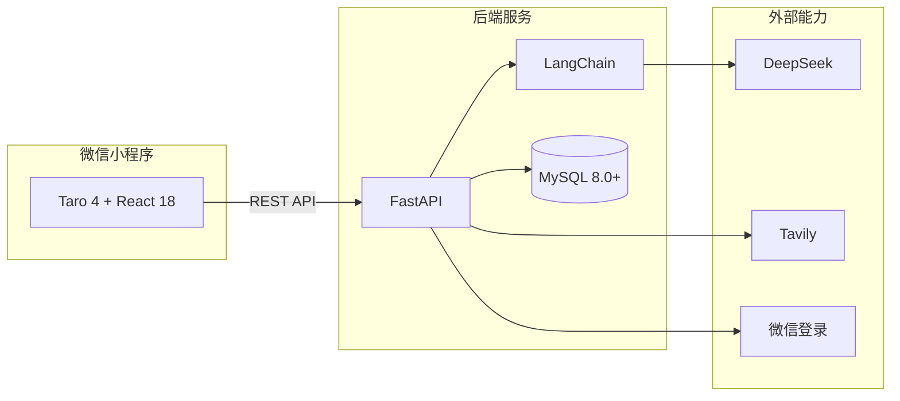

# AI炼金 · ai-alchemy

> 一款 AI 智能知识闯关微信小程序 —— 将任意知识内容通过 AI 编辑成题目，以游戏化闯关方式帮助用户学习。

把「被动阅读」变成「主动通关」：**输入即学 · 即时讲解 · 复盘分享 · 成长沉淀**。

---

## ✨ 核心特性

- **智能出题** — 粘贴文本或开启联网搜索，AI 自动生成单选 / 多选 / 判断题闯关
- **联网检索** — 基于 Tavily Research Agent，支持关键词、URL 检索与主题消歧
- **游戏化闯关** — 3 点「灵韵」生命值，答错扣血，即时正误反馈与 AI 讲解
- **AI 复盘报告** — 正确率、薄弱点、学习建议、概念掌握度分析
- **战绩海报** — Canvas 绘制战绩图，支持保存相册与微信分享
- **用户成长体系** — 微信登录、经验等级、称号、闯关历史与错题本云端同步

---

## 🏗 技术架构



| 层级 | 技术 |
|------|------|
| 前端 | Taro 4、React 18、TypeScript、Zustand |
| 后端 | FastAPI、Python 3.11+、LangChain、Pydantic |
| AI | DeepSeek（结构化 · 出题 · 报告）、Tavily（联网检索） |
| 数据 | MySQL 8.0+（用户、历史、错题、经验） |
| 平台 | 微信小程序 |

---

## 📁 项目结构

```
ai-learn-go/
├── frontend/          # Taro 微信小程序（13 个页面）
├── server/            # FastAPI 后端（路由、服务、AI 链、测试）
├── docs/over/         # 项目文档（需求、方案、启动说明）
├── openspec/          # 功能规格与变更记录
└── package.json       # 根脚本：dev:backend / dev:frontend / db:init
```

---

## 🚀 快速开始

### 环境要求

| 组件 | 版本 |
|------|------|
| Node.js | 18+ |
| Python | 3.11+ |
| MySQL | 8.0+ |
| 微信开发者工具 | 基础库 ≥ 3.15.1 |

### 1. 克隆与安装依赖

```bash
git clone https://github.com/Lingou2077/ai-alchemy.git
cd ai-alchemy

# 前端
cd frontend && npm install && cd ..

# 后端
cd server
python -m venv .venv
# Windows
.venv\Scripts\pip install -r requirements.txt
# macOS / Linux
# source .venv/bin/activate && pip install -r requirements.txt
cd ..
```

### 2. 配置环境变量

```bash
cd server
cp .env.example .env   # Windows: copy .env.example .env
```

编辑 `server/.env`，至少配置：

| 变量 | 说明 |
|------|------|
| `DEEPSEEK_API_KEY` | [DeepSeek](https://platform.deepseek.com/) API Key |
| `DATABASE_URL` | MySQL 连接串 |
| `JWT_SECRET` | JWT 签名密钥 |
| `WECHAT_APP_ID` / `WECHAT_APP_SECRET` | 微信小程序凭证（或设 `DEV_MOCK_LOGIN=true`） |
| `TAVILY_API_KEY` | [Tavily](https://tavily.com/) Key（或设 `TAVILY_MOCK=true`） |

### 3. 初始化数据库

```bash
npm run db:init
```

### 4. 启动开发服务

```bash
# 终端 1 — 后端
npm run dev:backend

# 终端 2 — 前端编译
npm run dev:frontend
```

### 5. 打开微信开发者工具

1. 导入项目，目录选择 `frontend/`
2. AppID 与 `frontend/project.config.json` 保持一致
3. 勾选「不校验合法域名」（本地开发）
4. 浏览器访问 `http://127.0.0.1:8000/api/v1/health` 确认后端正常

> **真机调试**：需将 `frontend/config/dev.ts` 中的 `API_BASE_URL` 改为电脑局域网 IP，详见 [项目配置启动说明](docs/over/项目配置启动说明.md)。

---

## 📖 文档

| 文档 | 说明 |
|------|------|
| [需求分析](docs/over/AI炼金--需求分析.md) | 产品定位与已实现功能 |
| [方案设计](docs/over/AI炼金--方案设计.md) | 技术架构、API、数据模型 |
| [项目配置启动说明](docs/over/项目配置启动说明.md) | 环境配置、启动步骤、真机调试 |

---

## 🔄 核心流程

```
首页输入 → [可选] 联网检索 & 主题确认 → AI 出题 → 闯关答题（3 命）
    → AI 复盘报告 → [可选] 战绩海报分享 → 历史 / 错题本 / 经验成长
```

- **未登录**：可完整体验闯关，历史存于本地
- **已登录**：报告生成时自动同步云端历史、错题与经验值

---

## 📄 License

本项目目前为个人学习项目，暂未指定开源协议。如需二次使用，请联系作者。

---

## 👤 作者

**Lingou2077** — [GitHub](https://github.com/Lingou2077)
