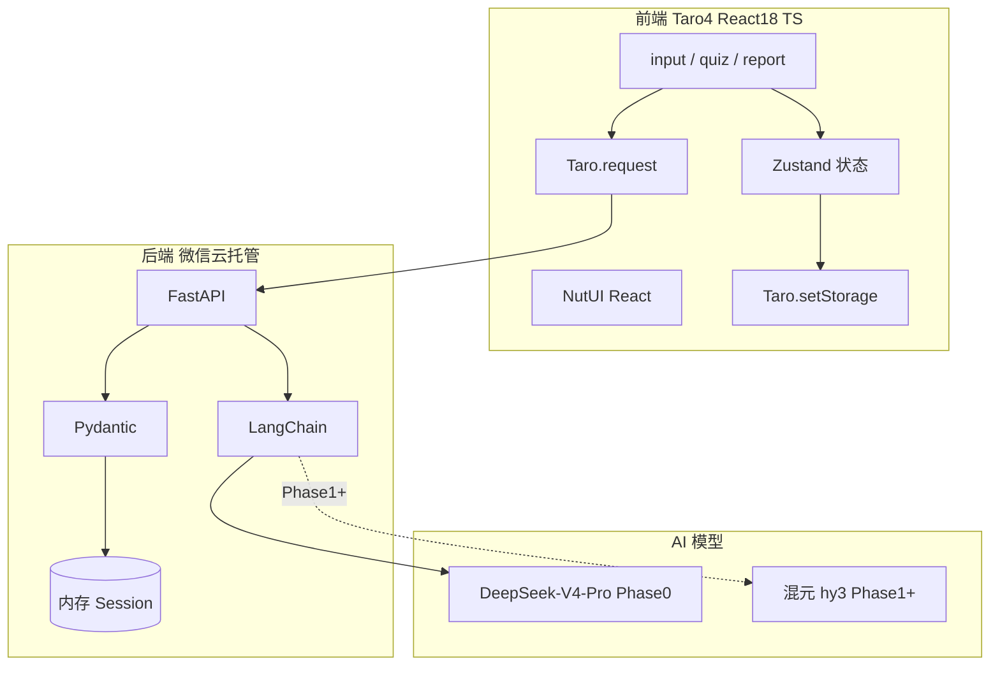
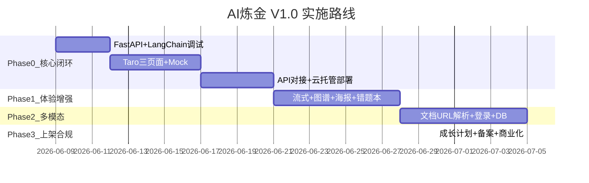
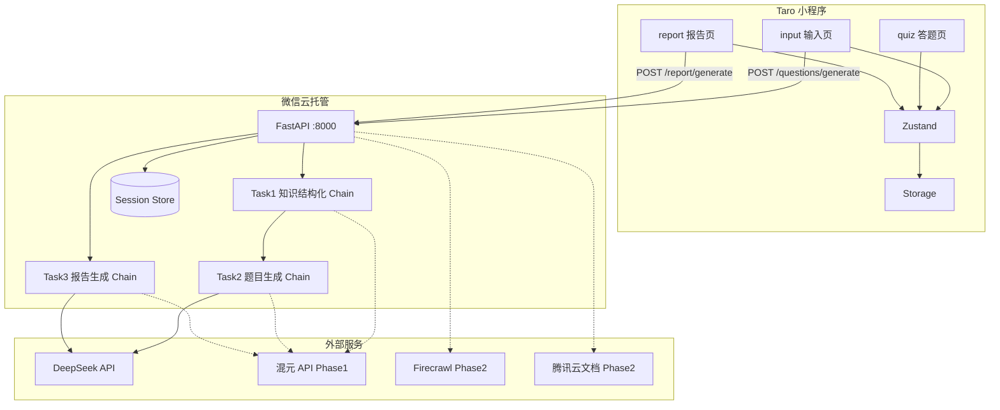
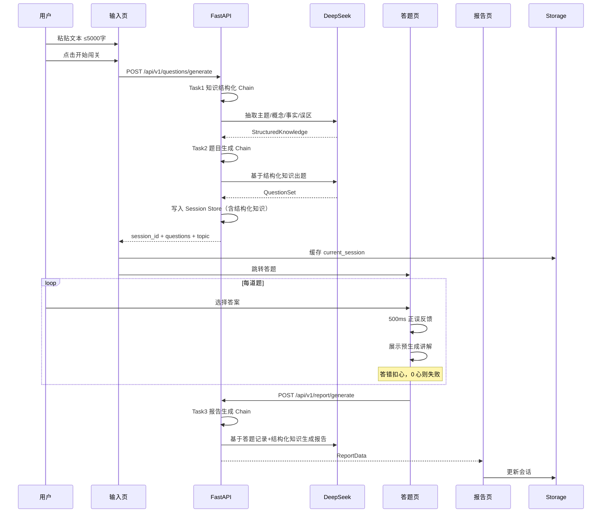
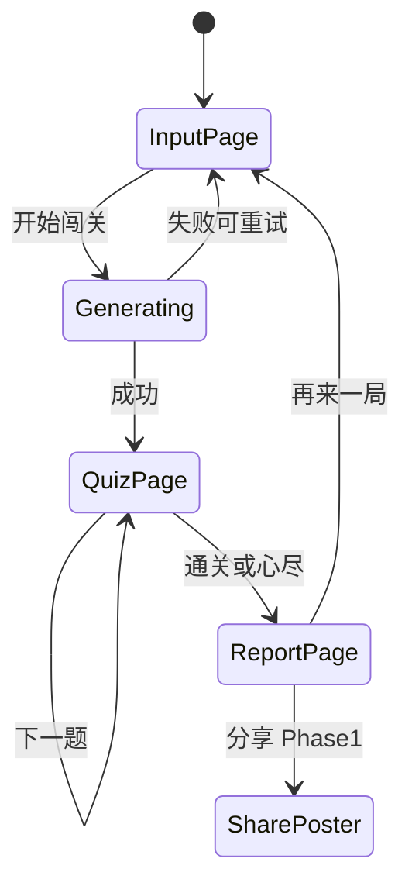
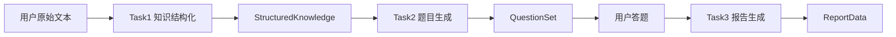
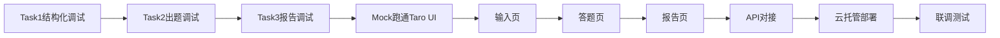

# AI炼金 — 方案设计文档（完整版 · 待人工审定）

> **版本：V3.1 终稿（含 Prompt 三任务拆分）**  
> **日期：2026-06-07**  
> **依据：** [版本6：AI炼金 - 需求分析文档.md](../版本6：AI炼金%20-%20需求分析文档.md)  
> **决策记录：** [TODO-待确认项.md](./TODO-待确认项.md)  
> **状态：已整合全部答复，待你审定终稿后启动 Phase 0。审定前不编写代码。**

---

## 0. 决策审定总表

本章汇总你已给出的全部答复，并记录冲突整合后的**最终落地决策**。

### 0.1 你已答复的决策项

| ID | 决策项 | 你的答复 | 最终落地 |
|----|--------|----------|----------|
| TODO-001 | 前端框架 | 方案 C：Taro 4 + React | **Taro 4 + React 18 + TypeScript** |
| TODO-002 | URL/文档解析 | 方案 D：混合方案 | Phase 2：腾讯云文档解析 + Firecrawl |
| TODO-003 | AI 模型 | 混元为主 + DeepSeek 降级 | **Phase 0：DeepSeek-V4-Pro；Phase 1+：混元主 + DeepSeek 降级** |
| TODO-004 | 知识图谱 | 方案 A：列表 + 色块 | Phase 1 概念标签 + 掌握度色块 |
| TODO-005 | AI 成长计划 | 暂不报名 | MVP 自付 DeepSeek API |
| TODO-006 | 算法备案 | 暂不考虑上线 | 体验版验证，备案延后 |
| TODO-007 | 后端语言 | Python | **FastAPI + LangChain**（非 Go） |
| TODO-008 | 基础设施 | 不用云开发；基础库 3.15.1；开发者工具已装 | 微信云托管部署后端 |
| TODO-009 | Prompt 工程 | 三任务拆分（结构化→出题→报告） | 见 §6 | 🟡 待审定 |

### 0.2 冲突整合结论（已按你的答复采纳）

| 冲突 | 原矛盾 | 整合结论 |
|------|--------|----------|
| 冲突-1 | 混元为主 vs 不用云开发 | Phase 0 无法直连混元，**先用 DeepSeek-V4-Pro**；开通腾讯云混元 API 或云开发后，Phase 1 切换为混元主模型 |
| 冲突-2 | 云开发 AI vs FastAPI | **废弃云函数 / wx.cloud.extend.AI**，AI 调用统一走后端 LangChain |
| 冲突-3 | 不报名成长计划 vs 想用混元 | MVP **自付 DeepSeek**，单次完整闯关约 0.15–0.4 元 |

### 0.3 最终技术栈一览



#### 前端技术栈

| 层级 | 技术 | 作用 |
|------|------|------|
| 小程序框架 | Taro 4 | 工程化、微信小程序构建 |
| UI 框架 | React 18 | 组件化、状态驱动视图 |
| 语言 | TypeScript | 类型约束，降低状态错误 |
| UI 组件库 | NutUI React（Taro 版） | 输入框、按钮、弹层、进度 |
| 状态管理 | Zustand | 会话、题目、答题进度、报告 |
| 网络请求 | Taro.request 封装 API Client | 对接 FastAPI REST |
| 图谱渲染 | ECharts + ec-canvas | Phase 1 知识掌握可视化 |
| 样式 | SCSS | 页面与组件样式 |

#### 后端技术栈

| 层级 | 技术 | 作用 |
|------|------|------|
| Web 框架 | FastAPI | REST API、异步、SSE（Phase 1） |
| 语言 | Python 3.11+ | AI 编排、校验、文本处理 |
| AI 编排 | LangChain | Prompt 管理、结构化输出、模型切换 |
| DeepSeek | langchain-deepseek / ChatDeepSeek | Phase 0 主模型 |
| 混元 | LangChain 兼容接入（Phase 1+） | 主模型切换目标 |
| 数据校验 | Pydantic v2 | 题目、会话、报告 Schema |
| 会话存储 | 内存 Session Store | Phase 0 暂存；Phase 2 换 DB |
| 部署 | 微信云托管 Docker | 容器运行 FastAPI |
| 可观测性 | LangSmith（可选） | Prompt 调试、链路追踪 |

#### LangChain 采用理由

- `ChatPromptTemplate` 组织 Prompt，比字符串拼接更稳定、易维护
- 结构化输出直接约束到 Pydantic Schema，适合 JSON 题目/报告场景
- `ChatOpenAI` 兼容 OpenAPI 接口，便于 DeepSeek / 混元切换
- 模型调用集中在 LangChain 层，后续加重试、RAG 扩展路径清晰

#### 基础设施配置

| 配置项 | 值 |
|--------|-----|
| 小程序 AppID | `wxae9e3547ab934143` |
| 云开发 envId | **不使用** |
| 后端部署 | 微信云托管 |
| API 域名 | 云托管分配（需加入小程序合法域名） |
| 基础库最低版本 | 3.15.1 |
| DeepSeek API Key | 云托管环境变量 `DEEPSEEK_API_KEY` |
| 微信开发者工具 | 已安装 |

---

## 1. 项目概述

### 1.1 项目定位

**AI炼金**是微信小程序，打造「多巴胺学习引擎」——用户输入知识内容，AI 生成交互式闯关题目，通过即时反馈与游戏化机制将「被动阅读」转化为「主动通关」。

### 1.2 设计目标

| 目标 | 说明 |
|------|------|
| 最小闭环优先 | 「文本输入 → AI 出题 → 答题闯关 → AI 复盘报告」 |
| 技术可扩展 | LangChain 层支持换模型、RAG、重试 |
| 快速验证 | 4 周 V1.0，单人学习闭环 |
| 低初期依赖 | 不用云开发、不报名成长计划、不做登录、暂不上架 |

### 1.3 核心原则

1. **人工需求 6 条为最高基准**，分阶段裁剪而非丢弃
2. **Phase 0 只做核心闭环**，登录/多模态/分享/图谱均延后
3. **AI Key 仅在后端**，不暴露给小程序客户端
4. **体验版验证**，正式上架与合规流程整体延后

---

## 2. 需求映射与实施路线

### 2.1 人工需求 6 条 → 阶段映射

| # | 人工需求 | Phase 0 | Phase 1 | Phase 2 |
|---|----------|---------|---------|---------|
| 1 | 输入知识（文本/文档/网页） | 纯文本 ≤5000 字 | — | 文档上传 + URL 抓取 |
| 2 | AI 从全网/特定源获取知识 | 不实现 | 不实现 | 仅 URL 正文抓取 |
| 3 | AI 生成闯关题目 | 单选/多选/判断 3–5 题 | SSE 流式进度 | 题量/难度可配置 |
| 4 | 答题 + 即时讲解 | 3 心 + 500ms 反馈 | — | — |
| 5 | 通关报告 + 分享 | 报告页 | 战绩海报 | — |
| 6 | 学习分析与复盘 | 仅当次会话 | 错题本（本地） | 学习历史 + 数据库 |

### 2.2 需求模块 → 阶段映射

| 模块 | 子功能 | 阶段 | 优先级 |
|------|--------|------|--------|
| 多模态输入 | 文本 + 字数统计 | Phase 0 | P0 |
| 多模态输入 | 附件 PDF/Word/TXT | Phase 2 | P2 |
| 多模态输入 | URL 智能抓取 | Phase 2 | P2 |
| AI 引擎 | 结构化 + 题目生成 | Phase 0 | P0 |
| AI 引擎 | 知识图谱 | Phase 1 简化版 | P1 |
| 闯关体验 | 线性关卡 + 生命值 + 反馈 | Phase 0 | P0 |
| 复盘分享 | 通关报告 | Phase 0 | P0 |
| 复盘分享 | 知识掌握可视化 | Phase 1 | P1 |
| 复盘分享 | 战绩海报 | Phase 1 | P1 |
| 个人中心 | 错题本 | Phase 1 | P1 |
| 个人中心 | 学习历史 | Phase 2 | P2 |

### 2.3 四阶段交付计划



| 阶段 | 周期 | 交付物 | 明确不做 |
|------|------|--------|----------|
| **Phase 0** | 第 1–2 周 | 文本输入→出题→答题→报告 | 登录、云开发、分享、图谱、多模态 |
| **Phase 1** | 第 3 周 | 流式加载、概念列表图谱、海报、错题本 | 多模态、账号 |
| **Phase 2** | 第 4 周 | 文档/URL 解析、登录、数据库 | 商业化 |
| **Phase 3** | 上架前 | 成长计划、备案、付费 | **当前整体跳过** |

---

## 3. 技术选型说明

### 3.1 前端：为何选 Taro 4 + React

| 对比项 | 原生 Skyline | **Taro 4 + React（已选）** | uni-app |
|--------|--------------|---------------------------|---------|
| React 生态 | 无 | 原生 | 需 Vue |
| TypeScript | 支持 | 一等支持 | 支持 |
| 与 FastAPI 对接 | 需自建 | Taro.request 直连 | 同左 |
| 状态管理 | 自行组织 | Zustand | Pinia |
| 跨端 | 仅微信 | 可扩 H5 | 多端 |

**结论：** 按你的选择，采用 Taro 4 + React 18 + TypeScript，通过 HTTP 对接后端，不使用 `wx.cloud` 体系。

### 3.2 后端：为何选 FastAPI + LangChain

| 对比项 | 云函数 Node.js | **FastAPI + Python（已选）** | Go 自建 |
|--------|----------------|------------------------------|---------|
| AI 生态 | 较弱 | LangChain 成熟 | 需自行封装 |
| 结构化输出 | 手动解析 | Pydantic + with_structured_output | 手动 |
| 部署 | 云开发绑定 | 云托管容器 | 需自建服务器 |
| 运维 | 低 | 低（云托管） | 高 |

**结论：** 按你的选择，Python FastAPI + LangChain 部署于微信云托管，废弃云函数与 Go 方案。

### 3.3 AI 模型分阶段策略

| 阶段 | 主模型 | 降级/备用 | 接入方式 |
|------|--------|-----------|----------|
| **Phase 0** | DeepSeek-V4-Pro | 无 | LangChain ChatDeepSeek |
| **Phase 1+** | 混元 hy3-preview | DeepSeek-V4-Pro | 腾讯云 API 或云开发开通后 |
| 备选 | Kimi / GLM | — | LangChain 兼容层 |

**Phase 0 调用链（三任务流水线）：**

```
POST /questions/generate
  → Task1 知识结构化 Chain → StructuredKnowledge
  → Task2 题目生成 Chain   → QuestionSet
POST /report/generate
  → Task3 报告生成 Chain   → ReportData
```

**成本（不报名成长计划，三任务拆分后）：**

| 操作 | AI 调用次数 | 费用估算 |
|------|-------------|----------|
| 单次闯关出题 | 2 次（结构化 + 出题） | 0.15–0.35 元 |
| 单次报告 | 1 次 | 0.05–0.1 元 |
| 完整闯关 | 3 次 | 0.2–0.45 元 |

### 3.4 状态与持久化

| 层级 | 技术 | 存储内容 |
|------|------|----------|
| 前端运行时 | Zustand | 当前题号、 hearts、选项状态 |
| 前端持久化 | Taro.setStorage | current_session、quiz_history、wrong_questions |
| 后端 Phase 0 | 内存 dict | session_id → 结构化知识 + 完整题目（含答案，防篡改） |
| 后端 Phase 2 | **MySQL 8.0+**（云托管 / 自建） | 用户、闯关历史、错题、经验成长 |

### 3.5 Phase 2 多模态解析（已选方案 D）

| 输入类型 | 服务 | 接入方式 |
|----------|------|----------|
| PDF / Word / TXT | 腾讯云数据万象 | FastAPI 后端调用 |
| 网页 URL | Firecrawl API | FastAPI 后端代理 |

---

## 4. 系统架构

### 4.1 整体架构图



### 4.2 核心业务流程



### 4.3 页面状态流转



---

## 5. 数据设计

### 5.1 前端 TypeScript 类型

```typescript
// src/types/session.ts

export interface SessionData {
  sessionId: string;
  topic: string;
  sourceContent: string;
  createdAt: number;
  status: 'generating' | 'playing' | 'completed' | 'failed';
  levels: Level[];
  hearts: number;               // 初始 3
  currentLevel: number;
  currentQuestion: number;
  answers: AnswerRecord[];
  startedAt: number;
  finishedAt?: number;
}

export interface Question {
  id: string;
  type: 'single' | 'multiple' | 'boolean';
  difficulty: 'easy' | 'medium' | 'hard';
  stem: string;
  options: { key: string; text: string }[];
  answer: string[];
  explanation: string;
  conceptTags: string[];
}

export interface AnswerRecord {
  questionId: string;
  userAnswer: string[];
  isCorrect: boolean;
  timeSpent: number;
  answeredAt: number;
}

export interface ReportData {
  sessionId: string;
  topic: string;
  accuracy: number;
  totalQuestions: number;
  correctCount: number;
  wrongCount: number;
  duration: number;
  weakPoints: WeakPoint[];
  summary: string;
  suggestion: string;
  conceptMastery: ConceptNode[];
}

export interface ConceptNode {
  name: string;
  mastery: 'mastered' | 'partial' | 'weak';
  relatedQuestionCount: number;
}
```

### 5.2 后端 Pydantic 模型

```python
# server/schemas/knowledge.py — Task 1 输出

class Concept(BaseModel):
    name: str
    description: str
    importance: Literal["high", "medium", "low"]

class StructuredKnowledge(BaseModel):
    topic: str
    summary: str
    concepts: list[Concept]
    key_facts: list[str]
    misconceptions: list[str]

# server/schemas/question.py — Task 2 输出

class Question(BaseModel):
    id: str
    type: Literal["single", "multiple", "boolean"]
    difficulty: Literal["easy", "medium", "hard"]
    stem: str
    options: list[Option]
    answer: list[str]
    explanation: str
    concept_tags: list[str] = Field(alias="conceptTags")

class GenerateQuestionsRequest(BaseModel):
    content: str = Field(max_length=5000)
    questions_per_level: int = Field(default=5, ge=3, le=10)

class GenerateQuestionsResponse(BaseModel):
    session_id: str
    topic: str
    levels: list[Level]
```

### 5.3 REST API 契约

#### POST `/api/v1/questions/generate`

请求：
```json
{ "content": "学习文本", "questions_per_level": 5 }
```

响应：
```json
{
  "session_id": "uuid",
  "topic": "知识主题",
  "levels": [{ "level_index": 1, "questions": [] }]
}
```

错误码：`400` 参数无效 · `422` 校验失败 · `503` AI 超时 · `500` 内部错误

#### POST `/api/v1/report/generate`

请求：
```json
{
  "session_id": "uuid",
  "answers": [
    { "question_id": "q1", "user_answer": ["B"], "is_correct": false, "time_spent": 3200 }
  ]
}
```

响应：
```json
{
  "accuracy": 80,
  "weak_points": [],
  "summary": "...",
  "suggestion": "...",
  "concept_mastery": []
}
```

#### GET `/api/v1/health`

响应：`{ "status": "ok" }`，供云托管探活。

### 5.4 本地 Storage Key

| Key | 类型 | 阶段 | 说明 |
|-----|------|------|------|
| `current_session` | SessionData | Phase 0 | 当前会话，支持断点恢复 |
| `quiz_history` | HistoryItem[] | Phase 1 | 最多 20 条摘要 |
| `wrong_questions` | WrongQuestion[] | Phase 1 | 错题本 |

---

## 6. Prompt 与 AI 工程

> **本章直接决定产品质量。** AI 炼金不是「问模型拿一段话」，而是要把模型输出收敛成**稳定的数据产品**。  
> **核心原则（TODO-009）：** 将 AI 处理拆成三个独立任务，而非一次 Prompt 生成所有内容。

### 6.0 设计原则：三任务流水线



| 任务 | 职责 | 输入 | 输出 | 触发时机 |
|------|------|------|------|----------|
| **Task 1 知识结构化** | 从原文抽取可教学的知识骨架 | 用户原始文本 | `StructuredKnowledge` | 点击「开始闯关」 |
| **Task 2 题目生成** | 基于结构化知识出题 | `StructuredKnowledge` | `QuestionSet` | Task 1 成功后串行执行 |
| **Task 3 报告生成** | 基于答题表现复盘 | `StructuredKnowledge` + 答题记录 | `ReportData` | 通关或心尽后 |

**拆分收益：**

1. **易调试**：可单独回归 Task 1/2/3，LangSmith 按 Chain 追踪
2. **易校验**：每步有独立 Pydantic Schema，失败可精确定位
3. **易迭代**：可单独优化「结构化」或「出题」Prompt，互不干扰
4. **质量更高**：Task 2 基于已抽取的概念与误区出干扰项，而非直接从长文本「猜题」

### 6.1 Task 1：知识结构化

**目标：** 将非结构化输入收敛为可出题的知识中间表示。

**Prompt 角色：** 知识工程师

**输出 Schema `StructuredKnowledge`：**

```python
class Concept(BaseModel):
    name: str                          # 概念名称
    description: str                   # 一句话定义
    importance: Literal["high", "medium", "low"]

class StructuredKnowledge(BaseModel):
    topic: str                         # 主题摘要（≤50字）
    summary: str                       # 内容摘要（≤200字）
    concepts: list[Concept]            # 关键概念（3–8 个）
    key_facts: list[str]               # 核心事实（3–10 条）
    misconceptions: list[str]          # 常见误区（2–5 条，供干扰项参考）
```

**Prompt 要点：**

```
从学习材料中抽取：
1. 主题摘要（topic）
2. 3–8 个关键概念，标注重要程度
3. 3–10 条核心事实（可独立验证的陈述）
4. 2–5 条常见误区（学习者容易混淆或误解的点）

要求：严格 JSON 输出，不编造材料中不存在的内容。
```

### 6.2 Task 2：题目生成

**目标：** 基于 `StructuredKnowledge` 生成闯关题目，**不直接读取原始长文本**。

**Prompt 角色：** 教育出题专家

**输入：** `StructuredKnowledge`（JSON 序列化）+ 题量参数

**输出 Schema：** `QuestionSet`（见 §5.2）

**Prompt 要点：**

```
基于以下结构化知识出题（不要使用原始材料以外的信息）：

## 结构化知识
{structured_knowledge}

## 出题约束
- 题量：{count} 道
- 题型比：单选 60% / 多选 20% / 判断 20%
- 难度比：简单 40% / 中等 40% / 困难 20%
- 干扰项必须来自 misconceptions 或概念间的常见混淆
- 每题 conceptTags 必须引用 concepts 中的名称
- 每题含 explanation（正误均展示，≤150字）
- 题目可用率目标 ≥ 80%
```

### 6.3 Task 3：报告生成

**目标：** 结合知识结构与真实答题表现，生成个性化复盘。

**Prompt 角色：** 学习分析专家

**输入：**
- `StructuredKnowledge`（会话缓存）
- `AnswerRecord[]`（用户答题记录）
- 本地计算的 `accuracy`、`duration`

**输出 Schema：** `ReportData`（见 §5.2）

**Prompt 要点：**

```
## 学习主题与知识结构
{structured_knowledge}

## 答题记录
{answers_detail}

## 本地统计
正确率：{accuracy}%  用时：{duration}秒

## 输出要求
1. summary：200字以内，概括本次所学核心内容
2. suggestion：100字以内，针对薄弱点的学习建议
3. weakPoints：关联到 concepts 中的概念名
4. conceptMastery：为每个 concept 评估 mastered/partial/weak
```

### 6.4 流水线编排（FastAPI 层）

```python
# server/services/question_pipeline.py（结构示意）

async def run_question_pipeline(content: str, count: int) -> tuple[str, StructuredKnowledge, QuestionSet]:
    # Step 1: 知识结构化
    knowledge = await knowledge_chain.ainvoke({"content": content})
    # Step 2: 题目生成（仅传入结构化知识）
    questions = await question_chain.ainvoke({
        "structured_knowledge": knowledge.model_dump_json(),
        "count": count,
    })
    session_id = create_session(content, knowledge, questions)
    return session_id, knowledge, questions
```

**`/questions/generate` 内部流程：**

1. 校验 + 截断输入文本
2. 执行 Task 1 → Pydantic 校验 `StructuredKnowledge`
3. 执行 Task 2 → Pydantic 校验 `QuestionSet`
4. 写入 Session Store（保存原文、结构化知识、题目含答案）
5. 返回前端所需字段（**不下发标准答案**）

**`/report/generate` 内部流程：**

1. 从 Session Store 读取 `StructuredKnowledge` + 题目
2. 校验用户提交的 `session_id` 与答案
3. 执行 Task 3 → Pydantic 校验 `ReportData`
4. 返回报告

### 6.5 LangChain Chain 结构

```python
# server/chains/knowledge_chain.py
knowledge_prompt = ChatPromptTemplate.from_messages([
    ("system", KNOWLEDGE_SYSTEM_PROMPT),
    ("human", "学习材料：\n{content}"),
])
knowledge_chain = knowledge_prompt | chat_model.with_structured_output(StructuredKnowledge)

# server/chains/question_chain.py
question_prompt = ChatPromptTemplate.from_messages([
    ("system", QUESTION_SYSTEM_PROMPT),
    ("human", "结构化知识：\n{structured_knowledge}\n\n请生成 {count} 道题。"),
])
question_chain = question_prompt | chat_model.with_structured_output(QuestionSet)

# server/chains/report_chain.py
report_prompt = ChatPromptTemplate.from_messages([
    ("system", REPORT_SYSTEM_PROMPT),
    ("human", "知识结构：\n{structured_knowledge}\n\n答题记录：\n{answers_detail}"),
])
report_chain = report_prompt | chat_model.with_structured_output(ReportData)
```

### 6.6 分步容错策略

| 失败步骤 | 错误码 | 处理策略 | 前端提示 |
|----------|--------|----------|----------|
| Task 1 结构化失败 | `503` | 重试 1 次；仍失败则中止 | 「知识解析失败，请精简内容后重试」 |
| Task 2 出题失败 | `503` | 重试 1 次；可降级为 3 题 | 「出题失败，请重试」 |
| Task 3 报告失败 | `503` | 重试 1 次 | 展示本地正确率，总结区显示「报告生成失败」 |
| 任一步 Pydantic 校验失败 | `422` | 记录 LangSmith trace，重试 | 同上 |
| 文本超 4000 字 | — | 截断 + `truncated: true` | 「内容已截断至前 4000 字」 |
| DeepSeek 超时（>30s/步） | `503` | 单步重试，不跨步重复 | 「AI 响应超时，请重试」 |

**调试建议：**

- Phase 0 第 1 天：先单独调通 Task 1，用 5 组样例验证 `StructuredKnowledge` 稳定性
- 第 2 天：固定 Task 1 输出，调通 Task 2
- 第 3 天：Mock 答题记录，调通 Task 3

### 6.7 前端 Loading 态（Phase 0 / Phase 1）

| 阶段 | Loading 文案 | 说明 |
|------|--------------|------|
| Phase 0 | 「AI 正在准备关卡…」 | 后端串行执行 Task 1+2，前端不感知子步骤 |
| Phase 1 | 「正在分析知识…」→「正在出题…」 | 后端分步返回或 SSE 推送进度 |

---

## 7. 页面与交互设计

### 7.1 页面清单

| 页面 | Taro 路径 | 阶段 | 功能 |
|------|-----------|------|------|
| 输入页 | `src/pages/input/index` | 0 | 文本输入、字数统计、发起闯关 |
| 答题页 | `src/pages/quiz/index` | 0 | 题目、3 心、500ms 反馈 |
| 报告页 | `src/pages/report/index` | 0 | 正确率、薄弱点、总结 |
| 错题本 | `src/pages/wrong-book/index` | 1 | 本地错题归档 |
| 历史 | `src/pages/history/index` | 2 | 学习历史列表 |

### 7.2 输入页

- 单一 textarea，placeholder：「粘贴你想学习的知识…」
- 实时字数：`已输入 N / 5,000 字`
- 📎 附件入口 Phase 0 **隐藏或置灰**（提示「即将上线」）
- 「开始闯关」→ 校验非空 → LoadingAI 组件 → 调 API

### 7.3 答题页

- 顶部：❤️❤️❤️ + 题号 `第 M/N 题`
- 选项点击 → 500ms 绿/红边框反馈 → 讲解滑入
- 答错扣 1 心；0 心跳转报告页（`status: failed`）
- 全部答完跳转报告页（`status: completed`）
- **讲解来自题目 JSON，不二次调 AI**

### 7.4 报告页

- 统计：正确率、用时、对错题数
- 薄弱知识点列表
- AI 知识总结 + 学习建议
- Phase 1：概念掌握色块 `[概念A ✅] [概念B ⚠️] [概念C ❌]`
- Phase 1：「分享战绩」按钮（canvas 海报）
- 「再来一局」返回输入页

---

## 8. 项目目录结构

```
ai-learn-go/
├── src/                              # Taro 小程序
│   ├── app.ts
│   ├── app.config.ts
│   ├── app.scss
│   ├── pages/
│   │   ├── input/
│   │   ├── quiz/
│   │   └── report/
│   ├── components/
│   │   ├── QuestionCard/
│   │   ├── HeartBar/
│   │   └── LoadingAI/
│   ├── stores/
│   │   └── sessionStore.ts
│   ├── services/
│   │   ├── api.ts
│   │   └── storage.ts
│   ├── types/
│   │   └── session.ts
│   └── utils/
├── server/                           # FastAPI 后端
│   ├── main.py
│   ├── routers/
│   │   ├── questions.py
│   │   └── report.py
│   ├── chains/
│   │   ├── knowledge_chain.py        # Task 1 知识结构化
│   │   ├── question_chain.py         # Task 2 题目生成
│   │   └── report_chain.py           # Task 3 报告生成
│   ├── schemas/
│   │   ├── knowledge.py            # StructuredKnowledge
│   │   ├── question.py
│   │   └── report.py
│   ├── services/
│   │   ├── session_store.py
│   │   └── question_pipeline.py      # 三任务编排
│   ├── prompts/
│   │   ├── knowledge.txt
│   │   ├── question.txt
│   │   └── report.txt
│   ├── requirements.txt
│   └── Dockerfile
├── config/
│   ├── index.ts
│   ├── dev.ts
│   └── prod.ts
├── docs/
│   ├── 版本6：AI炼金 - 需求分析文档.md
│   └── 方案设计/
│       ├── AI炼金-方案设计文档.md     # 本文档
│       └── TODO-待确认项.md
├── project.config.json
├── package.json
└── tsconfig.json
```

---

## 9. Phase 0 实施计划（审定后执行）

> **本章为审定通过后的执行蓝图，当前不启动。**

### 9.1 环境准备

| # | 事项 | 负责 | 状态 |
|---|------|------|------|
| 1 | Node.js 18+、Python 3.11+ | 开发者 | 待执行 |
| 2 | Taro 4 项目初始化 | 开发者 | 待执行 |
| 3 | 微信云托管开通 + 创建服务 | 开发者 | 待执行 |
| 4 | DeepSeek API Key → 云托管环境变量 | 开发者 | 待执行 |
| 5 | 云托管域名 → 小程序合法域名 | 开发者 | 待执行 |
| 6 | 微信开发者工具 | 开发者 | 已具备 |
| 7 | 基础库 3.15.1 | 开发者 | 已确认 |

### 9.2 开发顺序



| 步骤 | 内容 | 工期 |
|------|------|------|
| 1 | 三任务 Chain 分步调试（Task1→Task2→Task3） | 2–3 天 |
| 2 | Taro 4 初始化 + NutUI + Zustand | 0.5 天 |
| 3 | Mock 5 道题跑通 input→quiz→report | 1 天 |
| 4 | 三页面 + 三组件开发 | 3–4 天 |
| 5 | api.ts 对接 + 错误处理 | 1–2 天 |
| 6 | Dockerfile + 云托管部署 | 1 天 |
| 7 | 联调 + 测试清单 | 1–2 天 |

### 9.3 Phase 0 测试清单

| # | 测试项 | 预期 |
|---|--------|------|
| 1 | 空文本点闯关 | 提示「请输入学习内容」 |
| 2 | 5000 字边界 | 正常出题 |
| 3 | 超 5000 字 | 前端拦截或后端截断提示 |
| 4 | Task1 结构化失败 | 提示「知识解析失败」 |
| 5 | Task2 出题失败 | 提示「出题失败」可重试 |
| 6 | API 超时 | 友好重试 |
| 7 | 答对 | 绿框 + 讲解，心不变 |
| 8 | 答错 | 红框 + 讲解，扣 1 心 |
| 9 | 心尽 | 失败结算报告 |
| 10 | 通关 | Task3 完整 AI 复盘 |
| 11 | Task3 报告失败 | 展示本地正确率 |
| 12 | 退出重进 | Storage 恢复会话 |
| 13 | /health | 200 ok |
| 14 | 合法域名 | 真机可请求 API |


## 11. 人工审定（V3.1 更新后请重新审定）

**V3.1 变更：§6 Prompt 与 AI 工程改为三任务流水线（结构化→出题→报告）。请重点审阅 §6 后回复。审定通过前不启动任何代码开发。**


### 审定检查清单

请快速核对以下要点是否符合你的预期：

- [x] 前端：Taro 4 + React 18 + TypeScript + NutUI + Zustand
- [x] 后端：FastAPI + Python + LangChain，部署微信云托管
- [x] AI：Phase 0 用 DeepSeek-V4-Pro；Phase 1+ 混元主 + DeepSeek 降级
- [x] **Prompt 三任务拆分：Task1 结构化 → Task2 出题 → Task3 报告**（§6）
- [x] Task2 基于 StructuredKnowledge 出题，不直接读长文本
- [x] 不使用云开发 / 云函数 / wx.cloud.extend.AI
- [x] 不报名成长计划，自付 API 费用（完整闯关约 0.2–0.45 元）
- [x] 暂不考虑正式上架与算法备案
- [x] Phase 0 仅核心闭环：文本输入→出题→答题→报告
- [x] Phase 1 图谱为概念列表+色块（非力导向图）
- [x] Phase 2 解析为腾讯云+Firecrawl 混合

---

## 附录

| 文档 | 链接 |
|------|------|
| 需求分析 | [版本6：AI炼金 - 需求分析文档.md](../版本6：AI炼金%20-%20需求分析文档.md) |
| 决策记录 | [TODO-待确认项.md](./TODO-待确认项.md) |
| Taro | https://docs.taro.zone/ |
| LangChain | https://python.langchain.com/ |
| FastAPI | https://fastapi.tiangolo.com/ |
| 微信云托管 | https://developers.weixin.qq.com/miniprogram/dev/wxcloudservice/wxcloudrun/src/ |
| DeepSeek API | https://platform.deepseek.com/ |
