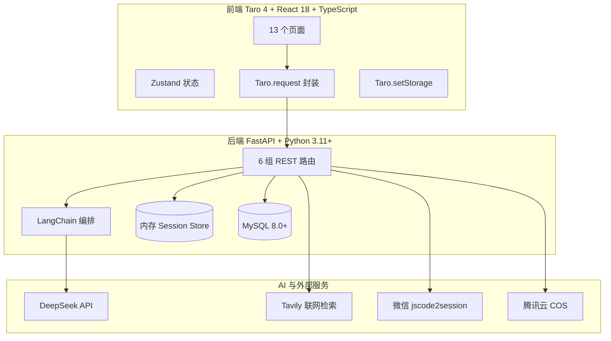
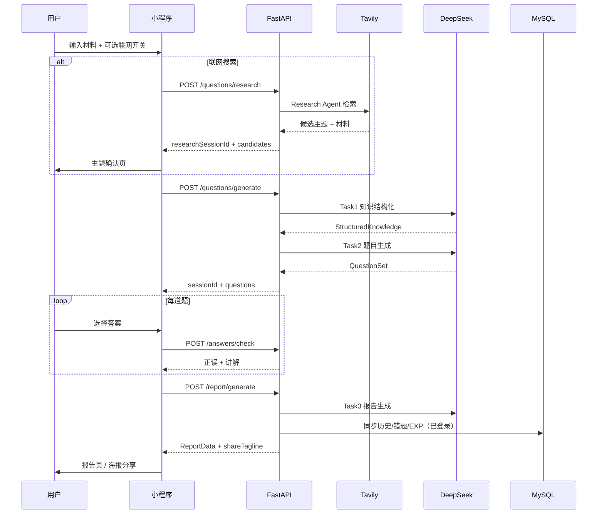
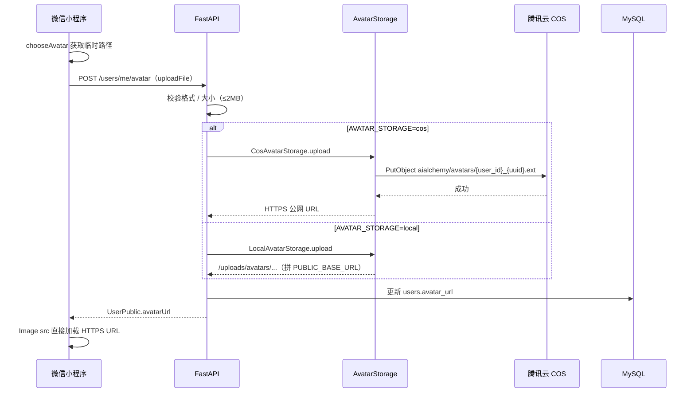

# AI炼金 — 方案设计（已实现功能版）

> **版本**：整合版 V1.1  
> **日期**：2026-06-10  
> **说明**：本文档描述当前已落地的技术架构与实现方案。规划中的技术选型见 [项目TODO.md](./项目TODO.md)。

---

## 1. 技术栈总览



| 层级 | 技术 | 说明 |
|------|------|------|
| 小程序框架 | Taro 4 | 编译为微信小程序，产物在 `frontend/dist/` |
| UI 框架 | React 18 + TypeScript | 组件化开发 |
| 状态管理 | Zustand | sessionStore、userStore |
| 后端框架 | FastAPI | 异步 REST API，监听 `0.0.0.0:8000` |
| AI 编排 | LangChain | Prompt 管理、结构化输出 |
| 主模型 | DeepSeek（OpenAI 兼容） | `deepseek-chat` |
| 联网检索 | Tavily + Research Agent | LangChain Tool 循环调用 |
| 持久化 | MySQL 8.0+ | 用户、历史、错题、经验流水 |
| 头像存储 | 腾讯云 COS | 后端中转上传；桶内 `aialchemy/avatars/`；支持 `local` 降级 |
| 会话存储 | 内存 dict | 答题 session、research session（带 TTL） |

---

## 2. 系统架构

### 2.1 目录结构

```
ai-learn-go/
├── frontend/                 # Taro 微信小程序
│   ├── src/pages/            # 13 个页面
│   ├── src/services/         # API、HTTP、Storage
│   ├── src/stores/           # Zustand 状态
│   ├── src/utils/            # 海报 Canvas、分享等
│   └── config/               # dev.ts / prod.ts 环境配置
├── server/                   # FastAPI 后端
│   ├── main.py               # 应用入口
│   ├── routers/              # API 路由
│   ├── services/             # 业务服务层
│   │   └── storage/          # 头像存储抽象（local / cos）
│   ├── chains/               # LangChain 链
│   ├── prompts/              # Prompt 模板（8 个 txt）
│   ├── schemas/              # Pydantic 模型
│   ├── db/                   # ORM 模型与 SQL
│   └── tests/                # 后端测试
├── docs/over/                # 本文档所在目录
└── package.json              # 根脚本：dev:backend / dev:frontend / db:init
```

### 2.2 核心业务流程



---

## 3. AI 流水线设计

### 3.1 三任务 Prompt 链

| 任务 | Chain 文件 | Prompt | 输出 |
|------|-----------|--------|------|
| Task1 知识结构化 | `chains/knowledge_chain.py` | `knowledge.txt` / `knowledge_grounded.txt` / `knowledge_explore.txt` | `StructuredKnowledge` |
| Task2 题目生成 | `chains/question_chain.py` | `question.txt` / `question_explore.txt` | `QuestionSet`（单关卡 3–10 题） |
| Task3 报告生成 | `chains/report_chain.py` | `report.txt` | 薄弱点、总结、建议、conceptMastery、shareTagline |
| 候选主题 | `chains/topic_candidate_chain.py` | `topic_candidate.txt` | 最多 3 个 `TopicCandidate` |

### 3.2 联网检索（Tavily Research Agent）

| 组件 | 路径 | 职责 |
|------|------|------|
| 输入分类 | `services/research/input_classifier.py` | keyword / url / mixed / text |
| Research Agent | `services/research/research_agent.py` | LangChain + Tavily tool 循环 |
| Tavily 工厂 | `services/research/tavily_tool_factory.py` | 真实 Tavily 或 Mock |
| Grounding | `services/grounding.py` | focused（单主题）/ explore_all（广泛了解） |
| 降级模式 | `schemas/research.py` | 无结果 / 部分结果 / 超时 → 合成候选 |

### 3.3 异步任务机制

- 前端 8s 轮询、5min 超时
- 任务步骤：`pending → research → topic_candidates → knowledge → questions → done/failed`
- 任务持久化：`generation_tasks` 表 + 内存 session
- TTL：research session 30min；generation task 1h

---

## 4. API 设计（已实现）

### 4.1 健康检查

| 方法 | 路径 | 说明 |
|------|------|------|
| GET | `/api/v1/health` | 返回 `{"status":"ok"}` |

### 4.2 认证

| 方法 | 路径 | 说明 |
|------|------|------|
| POST | `/api/v1/auth/login` | 微信 code → JWT + 用户信息 |

### 4.3 AI 闯关

| 方法 | 路径 | 说明 |
|------|------|------|
| POST | `/api/v1/questions/research` | 创建联网检索异步任务 |
| GET | `/api/v1/questions/research/{task_id}` | 轮询检索任务 |
| POST | `/api/v1/questions/generate` | 创建 AI 出题异步任务 |
| GET | `/api/v1/questions/generate/{task_id}` | 轮询出题任务 |
| POST | `/api/v1/answers/check` | 判题（返讲解，答案存 session 防篡改） |
| POST | `/api/v1/report/generate` | 生成报告；登录用户同步 DB + EXP |

### 4.4 用户与数据

| 方法 | 路径 | 说明 |
|------|------|------|
| GET/PATCH | `/api/v1/users/me` | 读/改昵称头像 |
| GET | `/api/v1/users/me/stats` | 用户统计 |
| GET/DELETE | `/api/v1/users/me/history[/{session_id}]` | 历史列表/详情/删除 |
| POST | `/api/v1/users/me/avatar` | 头像上传（后端中转至 COS 或本地，返回完整 URL） |
| GET | `/api/v1/users/me/wrong-questions[/{id}]` | 错题列表/详情 |

### 4.5 头像存储与静态资源

#### 头像上传流程



| 组件 | 路径 | 职责 |
|------|------|------|
| 头像服务 | `services/avatar_service.py` | 校验、生成 key、调用存储后端 |
| 存储工厂 | `services/storage/__init__.py` | 按 `AVATAR_STORAGE` 选择 local / cos |
| COS 后端 | `services/storage/cos_backend.py` | `cos-python-sdk-v5` 上传，返回公网 URL |
| 本地后端 | `services/storage/local_backend.py` | 写入 `uploads/avatars/`（开发降级） |

**COS 对象规范**（`AVATAR_STORAGE=cos` 时）：

| 项 | 值 |
|----|-----|
| Object Key | `aialchemy/avatars/{user_id}_{uuid}.{ext}` |
| 对外 URL | `https://{bucket}.cos.{region}.myqcloud.com/aialchemy/avatars/...` |
| DB 存储 | `users.avatar_url` 存完整 HTTPS URL |

**前端**：`services/userApi.ts` 中 `resolveAvatarSrc()` 对 `https://` 开头 URL 原样返回，无需改动。

#### 静态资源（本地兼容）

| 路径 | 说明 |
|------|------|
| `/uploads/avatars/` | 本地模式头像；`AVATAR_STORAGE=local` 时使用；历史本地头像只读兼容 |

---

## 5. 数据设计

### 5.1 MySQL 表

| 表 | ORM | 说明 |
|----|-----|------|
| `users` | `db/models/user.py` | openid、昵称、头像、exp、level、title |
| `quiz_records` | `db/models/quiz_record.py` | 闯关历史（正确率、总结、薄弱点等） |
| `wrong_questions` | `db/models/wrong_question.py` | 错题（题干、选项、累计答错次数） |
| `exp_logs` | `db/models/exp_log.py` | 经验流水（每 session 结算一次） |
| `generation_tasks` | `db/models/generation_task.py` | 异步 AI 任务状态机 |

初始化：`npm run db:init`（详见 [项目配置启动说明.md](./项目配置启动说明.md)）

### 5.2 经验成长体系

| 规则 | 值 |
|------|-----|
| 完成炼金 | +10 EXP |
| 闯关成功 | 额外 +5 EXP |
| 等级 | 1–10 级，对应称号体系 |
| 配置 | `services/exp_config.py` |

### 5.3 前端本地存储

| Key | 内容 |
|-----|------|
| `current_session` | 进行中闯关会话 |
| `quiz_history` | 本地历史（最多 20 条，未登录时使用） |
| `user_token` | JWT 登录凭证 |

---

## 6. 前端页面架构

### 6.1 页面清单（13 页）

| 页面 | 路径 | 类型 |
|------|------|------|
| 首页 | `pages/index` | Tab |
| 题库（历史列表） | `pages/question-bank` | Tab |
| 我的 | `pages/profile` | Tab |
| 生成中 | `pages/generating` | 流程 |
| 主题确认 | `pages/topic-confirm` | 流程 |
| 生成失败 | `pages/generate-fail` | 流程 |
| 答题 | `pages/quiz` | 流程 |
| 报告 | `pages/report` | 流程 |
| 分享海报 | `pages/share` | 流程 |
| 历史（重定向） | `pages/history` | 重定向至题库 Tab |
| 历史详情 | `pages/history-detail` | 数据 |
| 错题本 | `pages/wrong-book` | 数据 |
| 错题详情 | `pages/wrong-book-detail` | 数据 |

### 6.2 关键前端模块

| 模块 | 路径 | 作用 |
|------|------|------|
| API 封装 | `services/api.ts` | research/generate 任务、判题、报告 |
| 用户 API | `services/userApi.ts` | 登录、资料、历史、错题、头像 |
| HTTP 层 | `services/http.ts` | JWT 注入、401 重登、超时 |
| 海报 Canvas | `utils/posterCanvas.ts` | 750×1334 战绩图绘制 |
| 海报分享 | `utils/posterShare.ts` | 保存相册、微信分享 |
| 虚拟列表 | `components/VirtualList` | 长列表性能优化 |
| 灵韵徽章 | `components/LingyunBadge` | 3 命生命值展示 |

---

## 7. 安全与认证

| 项 | 实现 |
|----|------|
| JWT | `services/jwt_service.py`，默认 7 天过期 |
| 微信登录 | `services/auth_service.py`，jscode2session |
| 开发 Mock | `DEV_MOCK_LOGIN=true` 时跳过微信验证 |
| 答案防篡改 | 完整题目含答案仅存服务端 session，前端出题 API 不返回答案 |
| 密钥管理 | 所有 API Key（含 COS 密钥）在 `server/.env`，`.gitignore` 忽略 |
| 头像访问 | COS 模式走 HTTPS 公网域名；微信公众平台需配置 downloadFile 合法域名 |

---

## 8. 配置项

后端配置见 `server/config.py`，环境变量模板见 `server/.env.example`：

| 变量 | 用途 |
|------|------|
| `DEEPSEEK_API_KEY` | DeepSeek API |
| `DATABASE_URL` | MySQL 连接 |
| `JWT_SECRET` | JWT 签名 |
| `WECHAT_APP_ID` / `WECHAT_APP_SECRET` | 微信登录 |
| `TAVILY_API_KEY` / `TAVILY_MOCK` | 联网检索 |
| `PUBLIC_BASE_URL` | 本地模式头像对外 URL |
| `AVATAR_STORAGE` | 头像存储：`local` / `cos` |
| `COS_SECRET_ID` / `COS_SECRET_KEY` | 腾讯云 COS API 密钥 |
| `COS_REGION` / `COS_BUCKET` | COS 地域与桶名 |
| `COS_AVATAR_PREFIX` | 桶内前缀，默认 `aialchemy/avatars` |
| `COS_PUBLIC_BASE_URL` | COS 访问域名（如 `https://yunpic-1348558641.cos.ap-guangzhou.myqcloud.com`） |
| `DEV_MOCK_LOGIN` | 开发 Mock 登录开关 |

前端环境：

| 文件 | 用途 |
|------|------|
| `frontend/config/dev.ts` | 开发环境 API 地址 |
| `frontend/config/prod.ts` | 生产环境 API 地址 |

---

## 9. 测试

后端测试位于 `server/tests/`，覆盖：

- 认证与用户 API
- 出题 / 判题 / 报告流水线
- Tavily Research Agent（含 Mock）
- 经验服务、错题服务、历史服务
- 分享 tagline 生成
- 头像上传（local / cos 模式，含 `test_avatar_service`、`test_cos_backend`）

---

## 10. 已知技术限制

| 限制 | 说明 |
|------|------|
| 答题 session 存内存 | 服务重启后进行中会话丢失 |
| 前端输入 500 字 | 后端支持 5000 字，前端有独立上限 |
| 本地 Storage 不迁移 | 登录后新数据走云端，旧本地历史不自动合并 |
| 无 SSE 流式 | 生成进度通过轮询展示，非流式推送 |
| 旧本地头像未迁移 | 历史 `http://IP:8000/uploads/...` 头像仍依赖本机静态服务；新上传走 COS |
| 换头像不删旧 COS 对象 | 每次上传新 uuid 文件，旧对象留存于桶内 |

更多待改进项见 [项目TODO.md](./项目TODO.md)。详细迁移方案见 [头像COS存储-方案设计.md](./头像COS存储-方案设计.md)。
