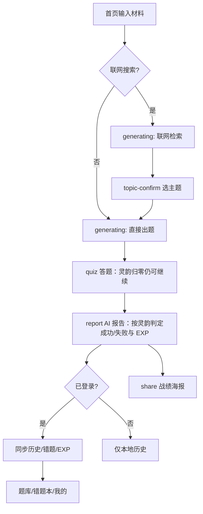

# AI炼金 — 需求分析（已实现功能版）

> **版本**：整合版 V1.1  
> **日期**：2026-06-11  
> **说明**：本文档基于当前代码库与已归档 OpenSpec 变更整理，**仅描述已实现功能**。规划中但未落地的能力见 [项目TODO.md](./项目TODO.md)。

---

## 1. 产品定位

**AI炼金**是一款微信小程序，打造「多巴胺学习引擎」——用户输入想学习的知识内容，AI 自动生成交互式闯关题目，通过即时反馈与游戏化机制，将「被动阅读」转化为「主动通关」。

**核心价值主张**：

- 输入即学，无需整理题库
- 即时正误反馈与 AI 讲解
- 通关复盘报告与战绩分享
- 个人学习档案云端沉淀

---

## 2. 目标人群

| 优先级 | 人群 | 核心场景 |
|--------|------|----------|
| P0 | 备考突击族（大学生、考证人群） | 考前突击、课后巩固 |
| P1 | 游戏玩家（攻略学习） | 版本更新速记、技巧掌握 |
| P1 | 职场充电者 | 通勤碎片学习、技能速成 |
| P2 | 终身学习者 | 兴趣探索、知识社交 |

---

## 3. 核心需求与实现对照

原始人工需求 6 条为最高基准，当前实现状态如下：

| # | 核心需求 | 实现状态 | 已实现说明 |
|---|----------|----------|------------|
| 1 | 用户可输入想学习的知识（文本/文档/网页） | **部分实现** | 支持文本粘贴输入（前端上限 500 字）；支持联网检索时输入关键词或 URL |
| 2 | AI 从全网或特定信息源获取知识 | **部分实现** | Tavily Research Agent 联网检索；支持关键词、URL、混合输入；无 Tavily Key 时可 Mock（降级策略） |
| 3 | AI 自动生成交互式闯关题目 | **已实现** | 单选 / 多选 / 判断题；每关 3–10 题（默认 5 题）；难度分简单 / 中等 / 困难 |
| 4 | 答题闯关 + 即时讲解 | **已实现** | 3 点「灵韵」值；答错扣 1 点；灵韵归零后仍可继续作答；服务端判题并返回讲解 |
| 5 | 通关报告 + 分享好友 | **已实现** | AI 复盘报告；Canvas 战绩海报；保存相册；微信分享图片菜单 |
| 6 | 个人学习分析与复盘 | **已实现** | 闯关历史、错题本、经验等级；报告含薄弱点、同比上次、本周第 N 次 |

---

## 4. 已实现功能模块

### 4.1 知识输入（首页）

| 功能 | 说明 |
|------|------|
| 文本输入 | 首页输入框粘贴学习材料，字数上限 500 字，实时统计 |
| 剪贴板粘贴 | 一键读取剪贴板内容 |
| 示例 Chip | 预设示例关键词，快速体验 |
| 联网搜索开关 | 开启后走 Tavily 检索流程；关闭则直接基于输入文本出题 |
| 最近历史预览 | 展示最近 2 条闯关记录（登录用户可走云端） |

**页面**：`pages/index/index`

### 4.2 联网检索与主题确认

| 功能 | 说明 |
|------|------|
| 异步检索任务 | 创建检索任务后轮询进度（research → topic_candidates） |
| 输入分类 | 自动识别 keyword / url / mixed / text |
| 候选主题 | 最多展示 3 个候选学习方向 |
| 主题选择 | 用户选定单一主题后继续出题 |
| 广泛了解 | 支持「不确定，广泛了解」选项，走 explore_all 模式 |
| 降级处理 | 无结果 / 部分结果 / Agent 超时时合成降级候选并提示 |
| Mock 模式 | 无 Tavily API Key 时使用 Mock 数据，便于本地开发 |

**页面**：`pages/generating/index`、`pages/topic-confirm/index`、`pages/generate-fail/index`

### 4.3 AI 出题与闯关答题

| 功能 | 说明 |
|------|------|
| 异步出题任务 | 知识结构化 → 题目生成，前端轮询任务状态 |
| 题型 | 单选、多选、判断 |
| 生命值 | 初始 3 颗灵韵，答错扣 1 颗；灵韵归零后仍可继续作答，全部完成后判定闯关失败（无 +5 EXP 加成，仍有 +10 EXP） |
| 即时判题 | 每题提交后服务端比对答案，返回正误与讲解 |
| 进度持久化 | 答题进度本地缓存，可恢复进行中会话 |
| 概念标签 | 题目关联 conceptTags，用于报告薄弱点分析 |

**页面**：`pages/generating/index`、`pages/quiz/index`

### 4.4 复盘报告

| 功能 | 说明 |
|------|------|
| 正确率统计 | 总题数、正确数、用时 |
| 薄弱点识别 | weakPoints 列表 |
| AI 总结与建议 | summary、suggestion |
| 概念掌握度 | conceptMastery（列表形式，掌握 / 部分 / 薄弱） |
| 经验奖励 | 全部答完 +10 EXP；灵韵未耗尽（闯关成功）额外 +5 EXP；灵韵耗尽仅 +10 EXP |
| 升级弹窗 | 经验达标时展示等级与称号变化 |
| 同比统计 | 比上次正确率变化、本周第 N 次炼成 |
| 相关历史 | 同主题近期闯关记录 |
| 分享文案 | shareTagline（AI 生成 + 规则兜底） |

**页面**：`pages/report/index`

### 4.5 战绩海报分享

| 功能 | 说明 |
|------|------|
| Canvas 绘制 | 750×1334 战绩海报，含成绩、主题、tagline、二维码 |
| 保存相册 | 导出图片到手机相册 |
| 微信分享 | `showShareImageMenu` 分享图片给好友 |
| 权限处理 | 相册授权失败时引导用户开启 |

**页面**：`pages/share/index`

### 4.6 用户身份与个人中心

| 功能 | 说明 |
|------|------|
| 微信登录 | `wx.login` + 后端 JWT；开发环境支持 Mock 登录 |
| 登录态维持 | Token 本地存储，401 自动重登 |
| 个人资料 | 查看 / 修改昵称、头像 |
| 头像上传 | `chooseAvatar` → `uploadFile` 至后端 → 后端中转存储至腾讯云 COS（`aialchemy/avatars/`），返回 HTTPS URL |
| 头像展示 | `<Image>` 直接加载 COS HTTPS 地址；真机需配置微信 downloadFile 合法域名 |
| 经验成长 | EXP、等级（1–10）、称号体系 |
| 统计数据 | 累计炼成次数、平均正确率 |
| 功能入口 | 答题历史、错题本 |

**页面**：`pages/profile/index`

### 4.7 个人数据中心

| 功能 | 说明 |
|------|------|
| 闯关历史列表 | Tab「题库」展示全部历史，虚拟列表 + 分页 |
| 历史详情 | 正确率、总结、建议、薄弱点（需登录） |
| 历史删除 | 支持单条删除 |
| 错题本 | 自动收录答错题目，累计答错次数 |
| 错题详情 | 题干、选项、正确答案、解析 |
| 双轨数据 | 未登录走本地 Storage（最多 20 条）；登录后优先云端，失败回退本地 |

**页面**：`pages/question-bank/index`、`pages/history-detail/index`、`pages/wrong-book/index`、`pages/wrong-book-detail/index`

> **说明**：Tab「题库」当前实现为**闯关历史列表**，非独立题目库功能。

### 4.8 导航结构

| Tab | 页面 | 作用 |
|-----|------|------|
| 首页 | `pages/index/index` | 输入材料、发起闯关 |
| 题库 | `pages/question-bank/index` | 闯关历史列表 |
| 我的 | `pages/profile/index` | 个人中心 |

---

## 5. 用户流程（已实现）

---

## 6. 非功能需求（当前实现）

| 项 | 现状 |
|----|------|
| 登录策略 | 不强制登录即可闯关；登录后数据云端同步 |
| 数据安全 | AI / COS 等 API Key 仅存后端 `.env`，不暴露给小程序 |
| 头像存储 | 生产 / 真机推荐 `AVATAR_STORAGE=cos`；本地开发可降级 `local` |
| 开发模式 | Mock 登录、Tavily Mock 支持无密钥本地调试 |
| 部署形态 | 当前以本地开发为主；生产云托管部署见 TODO |

---

## 7. 文档索引

| 文档 | 说明 |
|------|------|
| [AI炼金--方案设计.md](./AI炼金--方案设计.md) | 技术架构与实现方案 |
| [项目配置启动说明.md](./项目配置启动说明.md) | 环境配置与启动步骤 |
| [头像COS存储-方案设计.md](./头像COS存储-方案设计.md) | 头像 COS 迁移方案与配置说明 |
| [项目TODO.md](./项目TODO.md) | 规划中未实现功能与已知问题 |
