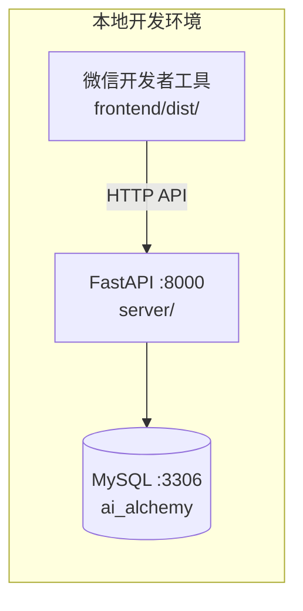

# AI炼金 — 项目配置与启动说明

> **版本**：整合版 V1.0  
> **日期**：2026-06-10  
> **说明**：整合 `docs/前后端启动.md`、`docs/AI炼金 · 微信小程序真机调试操作说明.md`、`server/db/README.md` 及 `server/.env.example`。

---

## 1. 环境要求

| 组件 | 版本要求 |
|------|----------|
| Node.js | 18+ |
| Python | 3.11+ |
| MySQL | 8.0+ |
| 微信开发者工具 | 已安装，基础库 ≥ 3.15.1 |

---

## 2. 项目架构

| 组件 | 运行位置 | 说明 |
|------|----------|------|
| 小程序前端 | 微信开发者工具 + 手机 | 源码 `frontend/`，编译产物 `frontend/dist/` |
| FastAPI 后端 | 本机终端，端口 `8000` | 源码 `server/`，监听 `0.0.0.0:8000` |
| MySQL | 本机 `127.0.0.1:3306` | 仅后端访问，手机无需直连 |



---

## 3. 首次配置

### 3.1 克隆与依赖安装

```powershell
# 项目根目录
cd d:\Code\ai-learn-go

# 前端依赖
cd frontend
npm install
cd ..

# 后端虚拟环境与依赖
cd server
python -m venv .venv
.venv\Scripts\pip install -r requirements.txt
cd ..
```

### 3.2 配置后端环境变量

```powershell
cd server
copy .env.example .env
```

编辑 `server/.env`，至少填写以下项：

| 变量 | 说明 | 必填 |
|------|------|------|
| `DEEPSEEK_API_KEY` | [DeepSeek 平台](https://platform.deepseek.com/) 获取 | 是（AI 功能） |
| `DATABASE_URL` | MySQL 连接串，如 `mysql+pymysql://root:密码@127.0.0.1:3306/ai_alchemy?charset=utf8mb4` | 是（用户系统） |
| `JWT_SECRET` | 随机长字符串 | 是（登录） |
| `WECHAT_APP_ID` | 小程序 AppID，需与 `frontend/project.config.json` 一致 | 微信登录时 |
| `WECHAT_APP_SECRET` | 微信公众平台 → 开发设置 | 微信登录时 |
| `DEV_MOCK_LOGIN` | 无 AppSecret 时设为 `true` 使用 Mock 登录 | 开发可选 |
| `TAVILY_API_KEY` | [Tavily](https://tavily.com/) 获取 | 联网搜索时 |
| `TAVILY_MOCK` | 无 Key 时设为 `true` | 开发可选 |
| `PUBLIC_BASE_URL` | 静态资源对外地址，默认 `http://127.0.0.1:8000` | 真机调试时改局域网 IP |
| `AVATAR_STORAGE` | 头像存储：`local`（本地）或 `cos`（腾讯云） | 真机头像显示推荐 `cos` |
| `COS_SECRET_ID` / `COS_SECRET_KEY` | 腾讯云 API 密钥 | `AVATAR_STORAGE=cos` 时必填 |
| `COS_BUCKET` | COS 桶名 |
| `COS_REGION` | COS 地域 |
| `COS_AVATAR_PREFIX` | 桶内目录前缀 | 默认 `aialchemy/avatars` |
| `COS_PUBLIC_BASE_URL` | COS 访问域名 |

真机头像上传示例（`server/.env`）：

```env
AVATAR_STORAGE=cos
COS_SECRET_ID=你的SecretId
COS_SECRET_KEY=你的SecretKey
COS_REGION=cos地域
COS_BUCKET=cos桶名
COS_AVATAR_PREFIX=aialchemy/avatars
COS_PUBLIC_BASE_URL=你的存储桶访问地址
```

微信公众平台 → 开发设置 → **downloadFile 合法域名** 需添加：

```
cos存储桶公网访问域名
```

> **安全提示**：`.env` 已被 `.gitignore` 忽略，切勿将密钥提交到 Git。

### 3.3 初始化数据库

确保 MySQL 服务已启动，然后执行：

```powershell
# 项目根目录
npm run db:init
```

将自动创建：

| 数据库 | 用途 |
|--------|------|
| `ai_alchemy` | 本地开发 |
| `ai_alchemy_test` | pytest 集成测试 |

并建表：`users`、`quiz_records`、`wrong_questions`、`exp_logs`、`generation_tasks`。

手动执行（可选）见 `server/db/README.md`。

### 3.4 配置前端 API 地址

编辑 `frontend/config/dev.ts`：

```ts
export default {
  env: {
    API_BASE_URL: '"http://127.0.0.1:8000"',  // 模拟器开发
    POSTER_SHARE_LANDING_URL: '"https://example.com/ai-alchemy"',
  },
}
```

---

## 4. 日常启动

建议启动顺序：

```
1. 启动 MySQL
2. 启动后端
3. 启动前端编译（watch）
4. 打开微信开发者工具
```

### 4.1 启动后端

```powershell
# 项目根目录 — 终端 1
cd d:\Code\ai-learn-go
npm run dev:backend
```

等价命令：

```powershell
cd server
.venv\Scripts\uvicorn main:app --reload --host 0.0.0.0 --port 8000
```

验证：浏览器访问 `http://127.0.0.1:8000/api/v1/health`，应返回 `{"status":"ok"}`。

### 4.2 启动前端编译

```powershell
# 项目根目录 — 终端 2
npm run dev:frontend
```

等价命令：

```powershell
cd frontend
npm run dev:weapp
```

保持 watch 模式运行，保存后自动编译到 `frontend/dist/`。

### 4.3 打开微信开发者工具

1. **导入项目** → 目录选择 `frontend/`（不是 `dist/`，工具通过 `project.config.json` 的 `miniprogramRoot: "dist/"` 读取编译产物）
2. AppID 与 `frontend/project.config.json` 中 `appid` 一致
3. 确认编译成功，模拟器能打开首页

**开发者工具设置**（详情 → 本地设置）：

- 勾选 **不校验合法域名、web-view（业务域名）、TLS 版本以及 HTTPS 证书**
- 项目已设 `"urlCheck": false`，界面中再确认一次

---

## 5. 根目录脚本一览

| 命令 | 说明 |
|------|------|
| `npm run dev:backend` | 启动 FastAPI 后端（热重载） |
| `npm run dev:frontend` | 启动 Taro 微信小程序 watch 编译 |
| `npm run build:frontend` | 生产构建小程序 |
| `npm run db:init` | 初始化 MySQL 数据库与表 |

---

## 6. 微信小程序真机调试

### 6.1 核心原理

- **模拟器**：`http://127.0.0.1:8000` 指向你的电脑，可正常访问后端
- **真机**：`127.0.0.1` 指向手机自身，**无法访问电脑后端**
- **解决**：将 API 地址改为电脑的**局域网 IP**

### 6.2 一次性网络配置

**Step 1：查询电脑局域网 IP**

```powershell
ipconfig
```

找到当前 Wi-Fi 适配器的 **IPv4 地址**。

**Step 2：修改前端 API 地址**

编辑 `frontend/config/dev.ts`：

```ts
API_BASE_URL: '"http://127.0.0.1:8000"'  // 替换为你的 IP
```

**Step 3：修改后端公开 URL**（测试头像上传时需要）

编辑 `server/.env`：

```env
PUBLIC_BASE_URL=http://127.0.0.1:8000
```

**Step 4：重新编译前端**

```powershell
cd frontend
npm run dev:weapp
```

### 6.3 前置条件清单

- [ ] 微信开发者工具已安装，AppID 与线上一致
- [ ] 扫码微信是该小程序的**开发者或体验成员**
- [ ] 手机与电脑连接**同一 Wi-Fi**
- [ ] MySQL 已启动，数据库 `ai_alchemy` 可用
- [ ] 后端 `.env` 中微信配置已填写（或使用 Mock 登录）
- [ ] Windows 防火墙允许 **8000 端口**入站

### 6.4 真机调试步骤

1. 按 §4 启动 MySQL、后端、前端编译
2. 微信开发者工具点击 **「真机调试」**
3. 手机微信扫码，进入调试模式
4. 在开发者工具 **真机调试面板** 查看 Console、Network
5. 确认请求 Host 为 `<你的IP>:8000`，而非 `127.0.0.1`

### 6.5 推荐验证流程

| 步骤 | 操作 | 验证点 |
|------|------|--------|
| 1 | 「我的」页登录 | `/api/v1/auth/login` 成功 |
| 2 | 首页输入关键词出题 | 轮询任务正常 |
| 3 | 完成答题、查看报告 | 报告接口返回正常 |
| 4 | 上传头像 | 图片 URL 使用 `PUBLIC_BASE_URL` |
| 5 | 分享海报 | 保存相册、微信分享 |

### 6.6 常见问题

| 现象 | 处理 |
|------|------|
| request:fail | 检查 API 是否改为局域网 IP；手机电脑同 Wi-Fi；防火墙放行 8000 |
| 登录失败 | 确认 AppID/AppSecret；扫码微信是开发者/体验者 |
| 头像不显示 | `PUBLIC_BASE_URL` 改为局域网 IP |
| 扫码无权限 | 公众平台 → 成员管理 → 添加开发者 |
| 路由器 AP 隔离 | 关闭访客网络隔离，或手机浏览器直接访问 `<IP>:8000/health` 测试 |

### 6.7 架构示意

```
┌─────────────────┐         Wi-Fi 局域网          ┌──────────────────────┐
│   你的手机       │  ── HTTP ──────────────►   │  你的电脑             │
│  微信小程序      │      <你的IP>:8000          │  FastAPI :8000       │
│  (真机调试)      │                             │  MySQL :3306 (本机)   │
└─────────────────┘                             └──────────────────────┘
         ▲                                                ▲
         │ 扫码 / 同步调试                                  │
┌─────────────────┐         编译产物              ┌──────┴───────────────┐
│  微信开发者工具   │ ◄──────────────────────────► │  frontend/dist/      │
│  (frontend/)    │                               │  npm run dev:weapp   │
└─────────────────┘                               └──────────────────────┘
```

---

## 7. 快速检查命令

```powershell
# 查 IP
ipconfig

# 测后端（替换 IP）
curl http://127.0.0.1:8000/api/v1/health

# 启动后端
cd d:\Code\ai-learn-go
npm run dev:backend

# 编译前端
cd d:\Code\ai-learn-go\frontend
npm run dev:weapp
```

---

## 8. 生产部署（概要）

当前以本地开发为主。正式上线需：

1. 后端部署至云服务器或微信云托管
2. 配置 HTTPS 域名并加入小程序 **request 合法域名**
3. 修改 `frontend/config/prod.ts` 中的 `API_BASE_URL`
4. 执行 `npm run build:frontend` 后上传审核

详细生产部署步骤见 [项目TODO.md](./项目TODO.md)。
