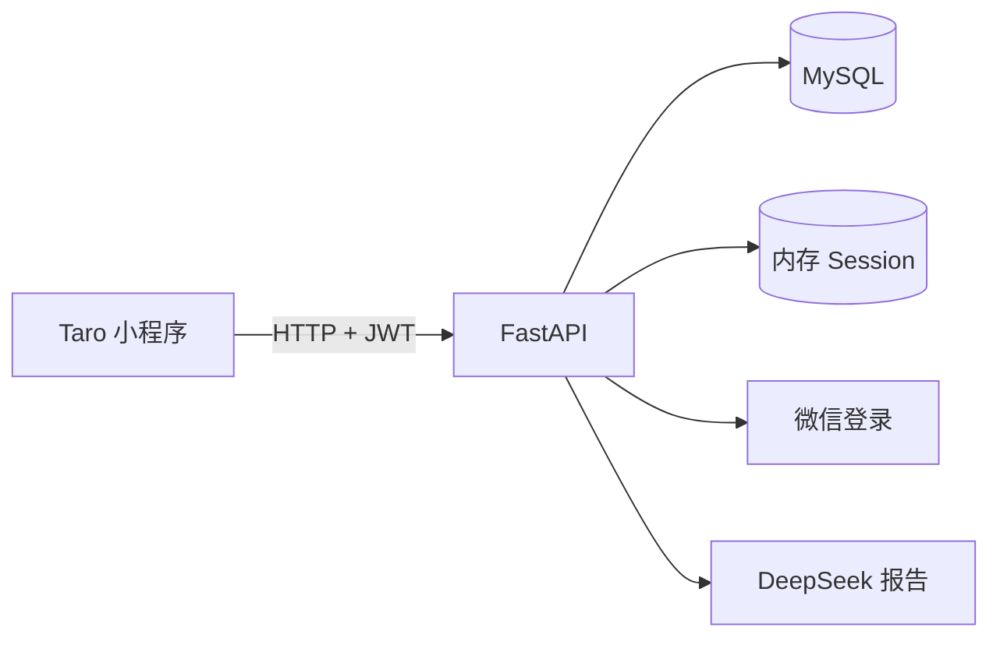

# 用户系统与成长体系 — 方案设计文档（简版）

> **版本：V1.2**  
> **日期：2026-06-08**  
> **状态：待人工确认，确认前不编写代码**  
> **依据：** [用户系统与成长体系-需求分析文档.md](./用户系统与成长体系-需求分析文档.md)

---

## 1. 目标与原则

在现有闯关闭环上，按需求文档**五批次**增量建设用户系统与成长体系。

| 原则 | 说明 |
|------|------|
| 最小侵入 | 出题/判题接口不变；报告接口在**已登录**时扩展写库 |
| 数据分层 | AI 会话仍用内存；用户数据落 **MySQL** |
| 可选登录 | 未登录可闯关；历史/经验仅登录后同步 |
| TDD | 后端按批次先写测试再实现 |
| UI | 已有 12 屏原型不改；个人中心沿用设计令牌 |

**不做：** 题库 Tab、多模态、海报分享、排行榜、付费。

---

## 2. 关键决策（待确认）

### 2.1 需求文档 §8 默认提案

| ID | 项 | 推荐 |
|----|-----|------|
| Q-01 | 登录时机 | 启动静默登录，**不阻断闯关** |
| Q-02 | 经验规则 | 完成 +10；炼成成功再 +5 |
| Q-03 | 等级称号 | 采纳需求文档 §6.4 |
| Q-04 | 个人中心 UI | 按 prototype 风格出稿（见 §6） |
| Q-05 | 本地历史迁移 | 首版不做 |
| Q-06 | 交付顺序 | 按五批次顺序 |
| Q-07 | 微信凭证 | `WECHAT_APP_SECRET`；缺省用 Mock |
| Q-08 | 题库 Tab | 继续占位 |

### 2.2 技术选型

| 项 | 选型 |
|----|------|
| 数据库 | **MySQL 8.0+**（不用 SQLite） |
| ORM / 迁移 | SQLAlchemy 2.x + Alembic |
| 驱动 | `pymysql`（同步，首版够用） |
| 登录 | `wx.login` → `jscode2session` → `openid` |
| 凭证 | JWT（7 天），`Authorization: Bearer` |
| 本地开发 | `DEV_MOCK_LOGIN=true`，Docker MySQL |

---

## 3. 架构（一图看懂）



**登录：** `wx.login` → `POST /auth/login` → 查/建用户 → 返回 token。

**报告（已登录）：** 生成 AI 报告 → 同事务写入历史、错题、经验（以 `session_id` 幂等）。

---

## 4. 数据表（4 张）

**库配置：** `utf8mb4` / `utf8mb4_unicode_ci`；时间字段统一 `DATETIME(3)`，默认 `CURRENT_TIMESTAMP(3)`。

**表关系：** `users` 1:N `quiz_records` / `wrong_questions` / `exp_logs`。

### 4.1 `users` — 用户与成长

| 字段 | 类型 | 空 | 默认 | 说明 |
|------|------|----|------|------|
| `id` | `BIGINT UNSIGNED` | N | 自增 | 主键，内部用户 ID |
| `openid` | `VARCHAR(64)` | N | — | 微信 openid |
| `nickname` | `VARCHAR(64)` | N | `'炼金学徒'` | 显示昵称 |
| `avatar_url` | `VARCHAR(512)` | N | `''` | 头像 URL |
| `exp` | `INT UNSIGNED` | N | `0` | 累计经验值 |
| `level` | `INT UNSIGNED` | N | `1` | 当前等级 |
| `title` | `VARCHAR(32)` | N | `'见习炼金师'` | 当前称号 |
| `total_quizzes` | `INT UNSIGNED` | N | `0` | 累计完成闯关次数 |
| `created_at` | `DATETIME(3)` | N | 当前时间 | 注册时间 |
| `updated_at` | `DATETIME(3)` | N | 当前时间 | 更新时间（ON UPDATE） |

**索引与约束：**

- `PRIMARY KEY (id)`
- `UNIQUE KEY uk_openid (openid)`

### 4.2 `quiz_records` — 闯关历史

| 字段 | 类型 | 空 | 默认 | 说明 |
|------|------|----|------|------|
| `id` | `BIGINT UNSIGNED` | N | 自增 | 主键 |
| `user_id` | `BIGINT UNSIGNED` | N | — | 外键 → `users.id` |
| `session_id` | `VARCHAR(36)` | N | — | 闯关会话 ID，幂等键 |
| `topic` | `VARCHAR(128)` | N | — | 学习主题 |
| `accuracy` | `DECIMAL(5,2)` | N | — | 正确率 0.00–100.00 |
| `question_count` | `INT UNSIGNED` | N | — | 题目数量 |
| `duration_sec` | `INT UNSIGNED` | N | — | 用时（秒） |
| `status` | `ENUM('completed','failed')` | N | — | `completed`=炼成成功；`failed`=灵韵散尽 |
| `summary` | `TEXT` | Y | `NULL` | AI 知识总结 |
| `suggestion` | `TEXT` | Y | `NULL` | AI 学习建议 |
| `weak_points` | `JSON` | Y | `NULL` | 薄弱点，`[{name, reason}]` |
| `finished_at` | `DATETIME(3)` | N | — | 闯关完成时间 |
| `created_at` | `DATETIME(3)` | N | 当前时间 | 记录写入时间 |

**索引与约束：**

- `PRIMARY KEY (id)`
- `UNIQUE KEY uk_session_id (session_id)` — 防重复写入
- `KEY idx_user_finished (user_id, finished_at DESC)` — 历史列表查询
- `CONSTRAINT fk_quiz_user FOREIGN KEY (user_id) REFERENCES users(id)`

### 4.3 `wrong_questions` — 错题本

| 字段 | 类型 | 空 | 默认 | 说明 |
|------|------|----|------|------|
| `id` | `BIGINT UNSIGNED` | N | 自增 | 主键 |
| `user_id` | `BIGINT UNSIGNED` | N | — | 外键 → `users.id` |
| `question_id` | `VARCHAR(64)` | N | — | 题目 ID（同次出题内唯一） |
| `session_id` | `VARCHAR(36)` | N | — | 来源闯关会话 |
| `topic` | `VARCHAR(128)` | N | — | 所属主题 |
| `stem` | `TEXT` | N | — | 题干 |
| `options` | `JSON` | N | — | 选项，`[{key, text}]` |
| `correct_answer` | `JSON` | N | — | 正确答案，`["A"]` |
| `explanation` | `TEXT` | N | — | 讲解 |
| `difficulty` | `VARCHAR(16)` | N | — | `easy` / `medium` / `hard` |
| `wrong_count` | `INT UNSIGNED` | N | `1` | 累计答错次数 |
| `last_wrong_at` | `DATETIME(3)` | N | — | 最近一次答错时间 |
| `created_at` | `DATETIME(3)` | N | 当前时间 | 首次收录时间 |

**索引与约束：**

- `PRIMARY KEY (id)`
- `UNIQUE KEY uk_user_question (user_id, question_id)` — 去重，重复答错 UPSERT
- `KEY idx_user_last_wrong (user_id, last_wrong_at DESC)` — 错题列表查询
- `CONSTRAINT fk_wrong_user FOREIGN KEY (user_id) REFERENCES users(id)`

### 4.4 `exp_logs` — 经验流水

| 字段 | 类型 | 空 | 默认 | 说明 |
|------|------|----|------|------|
| `id` | `BIGINT UNSIGNED` | N | 自增 | 主键 |
| `user_id` | `BIGINT UNSIGNED` | N | — | 外键 → `users.id` |
| `session_id` | `VARCHAR(36)` | N | — | 闯关会话 ID，防重复结算 |
| `amount` | `INT UNSIGNED` | N | — | 本次获得 EXP 总量 |
| `reason` | `VARCHAR(64)` | N | — | 主原因：`quiz_complete` / `quiz_success_bonus` |
| `exp_before` | `INT UNSIGNED` | N | — | 结算前经验 |
| `exp_after` | `INT UNSIGNED` | N | — | 结算后经验 |
| `level_before` | `INT UNSIGNED` | N | — | 结算前等级 |
| `level_after` | `INT UNSIGNED` | N | — | 结算后等级 |
| `created_at` | `DATETIME(3)` | N | 当前时间 | 结算时间 |

**索引与约束：**

- `PRIMARY KEY (id)`
- `UNIQUE KEY uk_session_id (session_id)` — 同一次闯关只结算一次
- `KEY idx_user_created (user_id, created_at DESC)`
- `CONSTRAINT fk_exp_user FOREIGN KEY (user_id) REFERENCES users(id)`

### 4.5 经验规则（非表内配置）

固化在 `exp_config.py`：

- 完成闯关：+10 EXP（不论成败）
- 炼成成功：再 +5 EXP
- 等级阈值与称号：见需求文档 §6.4（Lv.11+ 每级 +400，称号「传奇炼金师」）

---

## 5. API 一览

前缀 `/api/v1`，鉴权：`Bearer <token>`。

| 接口 | 鉴权 | 批次 | 说明 |
|------|------|------|------|
| `POST /auth/login` | 无 | 一 | `{ code }` → `{ token, user }` |
| `GET /users/me` | 必须 | 二 | 资料 + 等级 + 经验进度 + 统计 |
| `PATCH /users/me` | 必须 | 二 | 更新昵称、头像 |
| `GET /users/me/stats` | 必须 | 三 | 累计次数、正确率、本周次数、错题数 |
| `GET /users/me/history` | 必须 | 三 | 分页列表 |
| `GET /users/me/history/{sessionId}` | 必须 | 三 | 单次摘要详情 |
| `GET /users/me/wrong-questions` | 必须 | 三 | 错题分页列表 |
| `GET /users/me/wrong-questions/{id}` | 必须 | 三 | 错题详情 |
| `POST /report/generate` | 可选 | 三/四/五 | 原功能不变；**已登录**时写库，响应增加 `expGain`、`stats` |

`/questions/generate`、`/answers/check`：保持现状，鉴权可选。

**`report/generate` 新增请求字段（可选）：** `quiz_status`（completed/failed）、`duration_sec`。

**`report/generate` 新增响应字段（登录时）：**

- `expGain`：本次经验、是否升级（批次四）
- `stats`：`compareLastAccuracy`、`weeklyQuizIndex`（批次五）

---

## 6. 前端改动要点

| 模块 | 内容 |
|------|------|
| 新增 | `userStore`、`auth.ts`、`types/user.ts` |
| 新增页面 | `history`、`wrong-book` |
| 改造 | `profile`（我的）、`report`（EXP/统计）、`index`（最近炼成） |
| 启动 | `app.ts` 静默 `ensureLogin()` |
| API | 自动带 token；401 重新登录 |

**「我的」页结构：** 头像昵称 → 称号/等级/经验条 → 数据概览 → 学习历史、错题本入口。未登录显示登录引导。样式复用 `history-list`、`report-card`、`btn-comic` 等现有类名。

---

## 7. 后端模块（增量）

```
server/
├── db/models/          # user, quiz_record, wrong_question, exp_log
├── services/           # auth, user, exp, quiz_record, wrong_question
├── routers/            # auth, users
├── dependencies.py     # 可选/必须登录
├── alembic/            # 迁移
└── tests/              # 按批次：auth, users, exp, quiz_records, wrong_questions
```

---

## 8. 环境与部署

`server/.env` 新增（详见 `server/.env.example`）：

- `DATABASE_URL` — MySQL 连接串
- `JWT_SECRET`、`JWT_EXPIRE_SECONDS`
- `WECHAT_APP_ID`、`WECHAT_APP_SECRET`
- `DEV_MOCK_LOGIN`

本地：先启动 MySQL，再执行 `npm run db:init`（见 `server/db/README.md`）。将创建 `ai_alchemy` 与 `ai_alchemy_test` 并建 4 张表。后续业务开发可再接 Alembic 增量迁移。

---

## 9. 实施顺序（对齐需求五批次）

| 批次 | 交付物 | 后端测试 |
|------|--------|----------|
| **一** P0 | MySQL + 登录 API + 前端静默登录 | `test_auth.py` |
| **二** P0 | 用户信息 API +「我的」页 | `test_users.py` |
| **三** P1 | 历史/错题写读 + 首页/列表页 | `test_quiz_records.py`、`test_wrong_questions.py` |
| **四** P1 | 经验结算 + 我的/报告页成长 UI | `test_exp_service.py` |
| **五** P2 | 报告页「比上次」「本周第 N 次」 | 扩展集成测试 |

预估总工期：**约 6–7 天**（含联调）。

---

## 10. 测试要点（TDD）

| 场景 | 预期 |
|------|------|
| 首次/重复登录 | 建用户 / 不重复建 |
| 同 session 重复报告 | 历史、经验各仅一条 |
| 炼成 / 失败 | +15 / +10 EXP |
| 跨用户查历史 | 403 |
| 同题多次答错 | 错题 `wrong_count` 累加 |

---

## 11. 风险（简）

| 风险 | 应对 |
|------|------|
| 无 AppSecret | Mock 登录 |
| 报告写库失败 | 仍返回 AI 报告，提示同步失败 |
| Session 过期 | 须在有效期内生成报告（与现网一致） |

---

## 12. 审定清单

请确认后回复，**确认前不开发**：

- [ ] MySQL 8.0+，不用 SQLite
- [ ] §2.1 默认提案（Q-01～Q-08）
- [ ] 4 张表字段定义（§4.1～4.4）与 API 一览（§5）
- [ ] 经验规则：+10 / 通关 +5
- [ ] 五批次实施顺序（§9）
- [ ] 「我的」页结构（§6）

---

## 修订记录

| 版本 | 日期 | 说明 |
|------|------|------|
| V1.0 | 2026-06-08 | 首版完整方案 |
| V1.1 | 2026-06-08 | 精简为简版，保留关键决策与实施内容 |
| V1.2 | 2026-06-08 | 补充 4 张核心表完整字段定义 |
| V1.3 | 2026-06-08 | 补充 SQL 建表脚本与 `npm run db:init` 初始化方式 |
