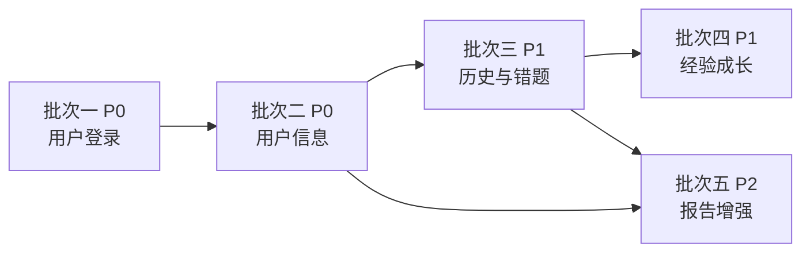

# 用户系统与成长体系 — 需求分析文档

> **版本：V1.1**  
> **日期：2026-06-08**  
> **状态：需求已确认方向，方案设计见配套文档**  
> **依据：** [版本6：AI炼金 - 需求分析文档.md](./版本6：AI炼金%20-%20需求分析文档.md)、[AI炼金-方案设计文档.md](./AI炼金-方案设计文档.md)  
> **配套方案：** [用户系统与成长体系-方案设计文档.md](./用户系统与成长体系-方案设计文档.md)  
> **说明：** 本文档仅描述「做什么、为什么、优先级」，不含技术方案与接口设计。方案设计确认后方可启动开发。

---

## 1. 背景与目标

### 1.1 背景

核心闯关闭环（文本输入 → AI 出题 → 答题 → 复盘报告）已基本完成，但当前存在以下局限：

- 无用户身份，无法区分不同使用者；
- 学习历史、错题等数据仅存于小程序本地 Storage，换设备即丢失；
- 「我的」Tab 为占位页，个人数据中心（需求分析 §3.5）尚未落地；
- 缺少游戏化成长机制，用户学习动力与成果可见性不足。

### 1.2 本次扩展目标

在**不破坏现有核心闯关流程**的前提下，分批建设：

1. **用户身份体系**：识别并持久化用户；
2. **个人数据中心**：学习历史、错题本、基础统计；
3. **经验成长体系**：完成炼金获得经验、升级解锁称号。

### 1.3 与原有需求的关系

| 原需求条目 | 本次扩展中的体现 |
|------------|------------------|
| 需求分析 §3.5 个人数据中心 · 错题本 | 批次三 |
| 方案设计 Phase 2 · 登录 + MySQL | 批次一、二、三 |
| 方案设计 Phase 1 · 学习历史 | 批次三 |
| 产品想法 · 经验升级与称号 | 批次四 |

### 1.4 设计约束（继承自既有决策）

- 前端：Taro 4 + React 18 + TypeScript（微信小程序）；
- 后端：FastAPI + Python；
- **持久化数据库：MySQL**（用户、闯关历史、错题、经验等关系型数据均落库；不使用 SQLite）；
- UI：核心流程页面须与 [01-核心业务流程.html](../prototypes/01-核心业务流程.html) 原型一致；个人中心相关页面**原型尚未提供详细稿**，方案设计阶段基于现有设计令牌补充，并须经人工确认；
- 后端功能开发须采用 TDD（测试驱动）；
- 需求与方案分文档维护：本文档定「做什么」；[方案设计文档](./用户系统与成长体系-方案设计文档.md)定「怎么做」。

### 1.5 基础设施决策（V1.1 新增）

| 决策项 | 结论 | 理由 |
|--------|------|------|
| 关系型数据库 | **MySQL 8.0+** | 用户、闯关记录、错题、经验流水等均为强关系数据，需外键约束、索引与事务；数据量增长后 MySQL 更易扩展与运维 |
| 不适用 SQLite | 明确不采用 | 本地文件库不适合多用户并发与云托管生产部署 |
| ORM | SQLAlchemy 2.x（方案阶段细化） | 与 FastAPI 生态契合，便于迁移与测试 |
| 闯关会话 | 仍用内存 Session Store | AI 出题会话为短时数据，与用户持久化数据分离 |

---

## 2. 需求分批与优先级总览

按「先打通身份 → 再展示用户 → 再沉淀数据 → 最后游戏化」顺序拆分，**批次间有依赖，须按序交付**。

| 批次 | 名称 | 优先级 | 依赖 | 核心价值 |
|------|------|--------|------|----------|
| **批次一** | 用户登录与身份识别 | **P0** | 无 | 建立用户唯一标识，后续功能前提 |
| **批次二** | 用户信息与个人主页 | **P0** | 批次一 | 用户可看到自己的身份与基础资料 |
| **批次三** | 闯关历史与错题本 | **P1** | 批次一、二 | 满足个人数据中心核心诉求，数据云端持久化 |
| **批次四** | 经验值、等级与称号 | **P1** | 批次一、三 | 游戏化激励，完成炼金有成长反馈 |
| **批次五** | 报告页统计增强 | **P2** | 批次三 | 对齐原型报告页「比上次」「本周第 N 次」等展示 |

**明确不在本次范围内（后续迭代）：**

- Tab「题库」独立功能（仍为占位）；
- 多模态输入（文档 / URL）；
- 战绩海报完整分享链路；
- 手机号绑定、社交关系、商业化付费；
- 正式上架合规（算法备案等）。

---

## 3. 批次一：用户登录与身份识别（P0）

### 3.1 需求描述

用户打开小程序后，应能**自动完成身份识别**，无需繁琐注册流程；系统为每位用户分配唯一身份，用于关联其学习数据。

### 3.2 用户故事

- 作为用户，我希望打开小程序就能开始学习，不需要手动注册账号；
- 作为用户，我希望换设备登录后仍能找到自己的数据（在后续批次中体现）；
- 作为开发者，我希望每个请求能识别是哪个用户发起的，以便写入个人数据。

### 3.3 功能点

| ID | 功能点 | 说明 | 验收标准 |
|----|--------|------|----------|
| U1-01 | 微信静默登录 | 利用微信小程序登录能力，在合适的时机获取用户身份 | 首次进入可完成登录；重复进入可自动恢复登录态 |
| U1-02 | 用户自动注册 | 首次登录的用户自动在系统中创建账号 | 同一微信用户多次登录对应同一账号 |
| U1-03 | 登录态维持 | 登录成功后，后续业务请求携带身份凭证 | 有效期内无需重复手动登录 |
| U1-04 | 登录态失效处理 | 凭证过期或无效时，能重新登录 | 用户无感知或仅短暂提示后恢复 |
| U1-05 | 本地开发支持 | 无微信正式环境时，开发/测试仍可验证登录流程 | 测试环境可模拟登录（具体方式在方案阶段确定） |

### 3.4 交互要点

- 登录过程对用户**尽量无感**，不在首页阻断「开始闯关」；
- 是否在「开始闯关」前强制登录，**待人工确认**（见 §8 待确认项）。

### 3.5 本批次交付边界

**包含：** 登录、身份创建、登录态管理。  
**不包含：** 昵称头像编辑、学习数据读写、经验值（属后续批次）。

---

## 4. 批次二：用户信息与个人主页（P0）

### 4.1 需求描述

登录用户可在「我的」Tab 查看个人资料与基础概览，替代当前占位页。

### 4.2 用户故事

- 作为用户，我希望在「我的」页面看到自己的头像和昵称；
- 作为用户，我希望知道系统已经认识我，而不是匿名使用；
- 作为用户，我希望有一个统一的个人入口，后续功能（历史、错题等）从这里进入。

### 4.3 功能点

| ID | 功能点 | 说明 | 验收标准 |
|----|--------|------|----------|
| U2-01 | 获取当前用户信息 | 已登录用户可查询自己的基本资料 | 返回昵称、头像、注册时间等约定字段 |
| U2-02 | 更新昵称 | 用户可修改显示昵称 | 修改后「我的」页即时展示新昵称 |
| U2-03 | 更新头像 | 用户可设置头像 | 修改后「我的」页即时展示新头像 |
| U2-04 | 个人主页框架 | 「我的」Tab 展示用户信息卡片 | 布局风格与现有原型设计令牌一致；**详细布局待方案阶段出稿确认** |
| U2-05 | 未登录态引导 | 未登录用户进入「我的」时给出登录引导 | 点击后可完成登录并刷新页面 |
| U2-06 | 功能入口预留 | 个人主页为后续模块预留入口位置 | 可见「学习历史」「错题本」等入口（批次三前可展示为「即将开放」或灰态） |

### 4.4 个人主页信息结构（需求层）

| 区域 | 内容 | 批次 |
|------|------|------|
| 用户卡片 | 头像、昵称 | 本批次 |
| 成长信息 | 等级、称号、经验进度 | 批次四 |
| 数据概览 | 累计炼成次数、平均正确率等 | 批次三起逐步填充 |
| 功能列表 | 学习历史、错题本 | 批次三 |

### 4.5 本批次交付边界

**包含：** 用户信息读写、「我的」页基础框架。  
**不包含：** 学习历史列表内容、错题列表内容、经验条动效（属后续批次）。

---

## 5. 批次三：闯关历史与错题本（P1）

### 5.1 需求描述

将闯关结果与学习痕迹**持久化到服务端**，并与用户账号绑定；实现需求分析文档 §3.5「错题本」及方案设计中延后的「学习历史」。

### 5.2 用户故事

- 作为用户，我希望每次炼金结束后，记录能被保存下来；
- 作为用户，我希望在首页看到「最近炼成」，并能查看全部历史；
- 作为用户，我希望答错的题目自动收录，方便日后复习；
- 作为用户，我希望换手机后历史记录仍在。

### 5.3 功能点 — 闯关历史

| ID | 功能点 | 说明 | 验收标准 |
|----|--------|------|----------|
| U3-01 | 闯关记录写入 | 每次完成答题并生成报告后，写入一条历史记录 | 记录与用户绑定；含主题、正确率、题量、用时、完成状态（炼成/失败） |
| U3-02 | 防重复写入 | 同一次闯关（同一 session）不重复记多条 | 重复提交报告不产生 duplicate |
| U3-03 | 首页「最近炼成」 | 首页展示最近 2 条记录 | 样式与原型屏 1/2 一致；数据来自服务端 |
| U3-04 | 学习历史列表页 | 点击「全部」进入完整列表 | 按时间倒序；展示分数环、主题、时间、题量 |
| U3-05 | 历史详情（简版） | 点击某条历史可查看该次摘要 | 至少含正确率、用时、知识总结、学习建议（来自当次报告） |
| U3-06 | 本地历史迁移（可选） | 若本地 Storage 有旧记录，登录后可合并 | **是否必须，待人工确认** |

### 5.4 功能点 — 错题本

| ID | 功能点 | 说明 | 验收标准 |
|----|--------|------|----------|
| U3-07 | 错题自动收录 | 答题过程中答错的题目写入错题本 | 含题干、选项、正确答案、讲解、所属主题 |
| U3-08 | 错题去重 | 同一题目不无限重复收录 | 按题目 ID 或内容指纹去重（策略方案阶段定） |
| U3-09 | 错题本列表页 | 「我的」→ 错题本，展示错题列表 | 按收录时间倒序 |
| U3-10 | 错题详情 | 点击可查看完整题目与讲解 | 用户可复习，无需重新闯关 |
| U3-11 | 失败报告联动 | 失败报告页「错题将自动收录」区域展示真实数据 | 对齐原型屏 10 文案与结构 |

### 5.5 功能点 — 基础统计

| ID | 功能点 | 说明 | 验收标准 |
|----|--------|------|----------|
| U3-12 | 累计炼成次数 | 个人主页展示总完成次数 | 与历史记录一致 |
| U3-13 | 平均正确率 | 个人主页展示历史平均正确率 | 基于已完成的闯关记录计算 |

### 5.6 本批次交付边界

**包含：** 历史写入/查询、错题写入/查询、首页与我的页数据联动。  
**不包含：** 经验值结算、报告页「比上次」对比（属批次四、五）。

---

## 6. 批次四：经验值、等级与称号（P1）

### 6.1 需求描述

引入「炼金成长」机制：用户每完成一次炼金获得经验值，积累经验可升级，并按等级解锁不同称号，增强游戏化激励。

> 来源：产品想法 —「每完成一次炼金 +10 经验，等级提升解锁称号（初级/中级/高级炼金师等）」。

### 6.2 用户故事

- 作为用户，我希望每次完成炼金都有即时正向反馈；
- 作为用户，我希望看到自己的炼金等级在成长；
- 作为用户，我希望升级后获得新称号，有成就感；
- 作为用户，我希望在「我的」页面看到自己的等级与进度。

### 6.3 经验值规则（需求草案，待确认）

| ID | 规则 | 草案值 | 待确认 |
|----|------|--------|--------|
| U4-R01 | 完成炼金基础奖励 | 每次走完答题并生成报告后 **+10 EXP** | 是否不论成败均奖励 |
| U4-R02 | 炼成成功加成 | 通关（炼成成功）额外 **+5 EXP** | 是否需要此加成 |
| U4-R03 | 防刷 | 同一 session 仅结算一次经验 | — |
| U4-R04 | 经验展示 | 报告页展示本次获得的经验 | — |

### 6.4 等级与称号（需求草案，待确认）

| 等级 | 累计经验（草案） | 称号（草案） |
|------|------------------|--------------|
| Lv.1 | 0 | 见习炼金师 |
| Lv.2 | 30 | 初级炼金师 |
| Lv.3 | 80 | 初级炼金师 |
| Lv.4 | 150 | 中级炼金师 |
| Lv.5 | 250 | 中级炼金师 |
| Lv.6 | 380 | 中级炼金师 |
| Lv.7 | 550 | 高级炼金师 |
| Lv.8 | 750 | 高级炼金师 |
| Lv.9 | 1000 | 高级炼金师 |
| Lv.10 | 1300 | 大师炼金师 |
| Lv.11+ | 每级 +400 | 传奇炼金师 |

### 6.5 功能点

| ID | 功能点 | 说明 | 验收标准 |
|----|--------|------|----------|
| U4-01 | 经验结算 | 闯关报告生成时自动结算经验 | 符合 §6.3 确认后的规则 |
| U4-02 | 等级计算 | 根据累计经验计算当前等级 | 升级阈值与 §6.4 一致 |
| U4-03 | 称号展示 | 根据等级展示对应称号 | 「我的」页、报告页可见 |
| U4-04 | 经验进度条 | 「我的」页展示当前等级经验进度 | 显示「当前 EXP / 升级所需 EXP」 |
| U4-05 | 升级反馈 | 等级提升时给予明显提示 | 报告页或全局弹层提示「恭喜晋升」 |
| U4-06 | 本次获得经验 | 报告页展示「+N EXP」 | 与结算规则一致 |

### 6.6 本批次交付边界

**包含：** 经验结算、等级称号、个人主页成长区、报告页经验/升级反馈。  
**不包含：** 经验排行榜、好友对比、付费加速升级。

---

## 7. 批次五：报告页统计增强（P2）

### 7.1 需求描述

对齐 UI 原型屏 9/10 中的统计对比信息，在通关/失败报告页展示与历史相关的增强数据。

### 7.2 功能点

| ID | 功能点 | 说明 | 验收标准 |
|----|--------|------|----------|
| U5-01 | 与上次对比 | 展示「比上次 +X%」或「比上次 -X%」 | 基于同用户上一次同主题或全局上一次记录 |
| U5-02 | 本周次数 | 展示「本周第 N 次」 | 自然周内炼金完成次数 |
| U5-03 | 相关历史 | 报告页底部展示同主题历史记录 | 对齐原型屏 9「相关历史」区块 |

### 7.3 本批次交付边界

**包含：** 报告页只读统计展示。  
**不包含：** 新的数据写入逻辑（依赖批次三已有数据）。

---

## 8. 待人工确认项

请在审阅本文档时一并确认，确认结果将写入方案设计文档：

| ID | 确认项 | 选项 / 说明 |
|----|--------|-------------|
| **Q-01** | 登录时机 | A. 打开小程序即静默登录（不阻断闯关） / B. 必须登录后才能闯关 |
| **Q-02** | 经验规则 | A. 仅 +10（不分成败） / B. +10 基础 + 通关额外 +5（草案默认） |
| **Q-03** | 等级曲线与称号表 | 是否采纳 §6.4 草案？需增减档位吗？ |
| **Q-04** | 个人中心 UI | 原型无「我的」详细稿，是否同意方案阶段基于现有设计令牌设计并再确认？ |
| **Q-05** | 本地历史迁移 | 是否需要在登录后将本地 Storage 历史合并到云端？ |
| **Q-06** | 批次范围 | 是否同意按 §2 五批次优先级交付？是否有批次需要提前或延后？ |
| **Q-07** | 微信凭证 | 是否已具备 AppSecret，可用于正式微信登录联调？ |
| **Q-08** | 「题库」Tab | 本次是否继续占位，不纳入用户系统迭代？ |

---

## 9. 验收原则（全批次通用）

1. **不破坏核心闭环**：未登录或新功能异常时，输入→出题→答题→报告主流程仍可用（除非 Q-01 确认为强制登录）；
2. **UI 一致性**：已有原型的页面（首页、答题、报告等）视觉与交互不变，仅做数据接入类增强；
3. **数据归属清晰**：用户 A 不可访问用户 B 的历史、错题、经验数据；
4. **后端测试覆盖**：各批次后端功能须有对应自动化测试，批次交付前测试通过；
5. **分批可演示**：每个批次结束时应可独立演示该批次价值，不必等全部完成。

---

## 10. 文档修订记录

| 版本 | 日期 | 说明 |
|------|------|------|
| V1.0 草案 | 2026-06-07 | 初稿：五批次需求拆分，待人工确认 |
| V1.1 | 2026-06-08 | 明确持久化采用 MySQL，不采用 SQLite；关联方案设计文档 |

---

**需求基准以本文档为准；技术实现见 [用户系统与成长体系-方案设计文档.md](./用户系统与成长体系-方案设计文档.md)。方案审定前不启动编码。**
