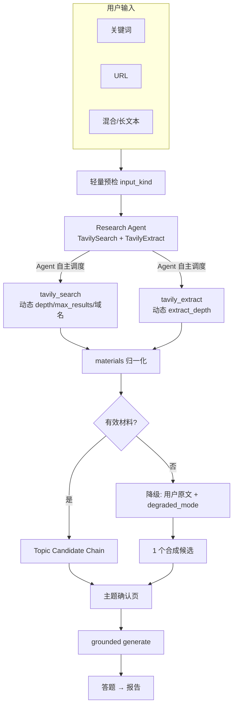
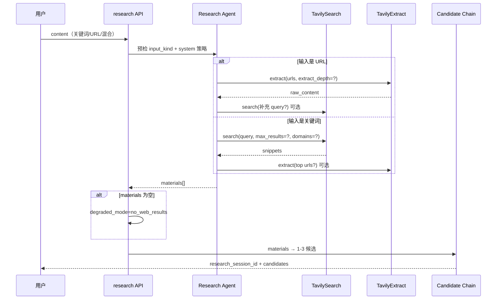

## Context

**现状**：三任务流水线（结构化 → 出题 → 报告）。联网能力尚未实现。

**人工新思路（本次纳入）**：
1. 用户可能输入关键词，也可能输入网页 URL，联网层必须两者兼容
2. 使用 LangChain 官方 **`langchain-tavily`** 的 `TavilySearch` + `TavilyExtract`，**作为 Tool 交给 Agent**，由 AI 决定调用时机与参数
3. 搜索无结果时必须**降级**，不能阻断学习闭环

**约束**：FastAPI + LangChain + DeepSeek；Taro 前端；TDD；Key 仅后端。

## Goals / Non-Goals

**Goals:**
- Agent 驱动的联网资料采集（search + extract）
- 关键词 / URL / 混合输入自动适配
- 国内外用户：Agent 动态调整地域、域名、深度、条数
- 无有效联网结果 → 降级用用户原文 + 明确提示
- 主题确认（含广泛了解）+ grounded 出题

**Non-Goals:**
- PDF/Word 附件上传（仍 Phase 2）
- 报告页引用来源列表
- SSE 流式 Agent 步骤推送（MVP 用 Loading 文案）
- 无限制 Agent 循环（必须 max_tool_calls 上限）

## Decisions

### D1：Research Agent 取代固定 Search Pipeline

**原方案**：`AsyncTavilyClient.search()` 固定 1 次、max_results=8。

**新方案**：`Research Agent` 绑定两个 LangChain 工具，bounded tool-calling loop：

```python
from langchain_tavily import TavilySearch, TavilyExtract

tavily_search = TavilySearch(
    max_results=8,           # 默认上限；Agent invoke 时可改 query/search_depth/include_domains 等
    search_depth="advanced",
    topic="general",
)
tavily_extract = TavilyExtract(
    extract_depth="basic",
    include_images=False,
)

# DeepSeek 绑定 tools，Agent 循环直至产出 ResearchBundle 或达步数上限
```

**参考文档**：
- [TavilySearch](https://docs.langchain.com/oss/python/integrations/tools/tavily_search) — invoke 时可动态传 `query`、`search_depth`、`time_range`、`include_domains`、`exclude_domains`
- [TavilyExtract](https://docs.langchain.com/oss/python/integrations/tools/tavily_extract) — invoke 时可动态传 `urls`、`extract_depth`（basic/advanced）

**注意**（官方约束）：`include_answer`、`include_raw_content` 只能在实例化时设置，不能在 invoke 时改，避免撑爆 context。

**步数上限**：`RESEARCH_AGENT_MAX_TOOL_CALLS=4`（可配置），防止成本失控。

**产出**：`ResearchBundle`（Pydantic）：
- `materials: list[WebMaterial]` — 统一归一化（source=search|extract, title, url, content, score?）
- `input_kind: keyword | url | mixed | text`
- `degraded_mode: none | no_web_results | partial | agent_timeout`
- `agent_trace_summary: str` — 简要说明 Agent 做了什么（调试用，可选返回前端）

候选主题仍由后续 **Topic Candidate Chain**（structured output）基于 `materials` 生成 1–3 个 `TopicCandidate`。

### D2：输入形态识别（预检 + Agent 协同）

**轻量预检**（Python，非 LLM）：

| 检测结果 | `input_kind` | Agent 引导 |
|----------|--------------|------------|
| 整段为合法 URL | `url` | 优先 `tavily_extract`；必要时再 search 补充背景 |
| 含 URL + 其他文字 | `mixed` | extract URL + search 关键词 |
| ≤200 字且无 URL | `keyword` | 优先 `tavily_search`；高价值 URL 可 extract |
| 长文本无 URL | `text` | 可选 search 验证/补充；材料不足则主要用原文 |

预检结论写入 Agent system prompt，**不替代** Agent 最终决策。

### D3：Agent 动态参数策略（国内外 + 简繁）

Agent system prompt 内嵌决策表，**由模型在 tool invoke 时选择**：

| 场景 | tavily_search 建议 | tavily_extract 建议 |
|------|---------------------|----------------------|
| 简单事实、定义清晰 | `search_depth=basic`, `max_results=3–5` | 通常不需要 |
| 复杂/多义/新技术 | `search_depth=advanced`, `max_results=6–8` | 对 top 1–2 URL `extract_depth=advanced` |
| 中文用户 / 中文 query | `include_domains` 倾向中文源（如 `zhihu.com`, `juejin.cn`, `bilibili.com`, `wikipedia.org` 中文路径等）；或构造中文 enriched query | 同左 |
| 英文/国际概念 | 不限制域名；可 `include_domains` 技术文档域（`docs.*`, `github.com`, `arxiv.org`） | `extract_depth=advanced` 抽官方文档 |
| 用户粘贴文章 URL | 跳过 search 或仅补充 1 次 | **首选 extract**，`extract_depth=advanced` |
| 搜索结果 snippet 已够 | 不再 extract | — |
| snippet 不足但 URL 可信 | — | extract 该 URL |

**地域**：若 Tavily/LangChain 工具链支持 `country` 参数则 Agent 可选用；否则用 `include_domains` + query 语言（中文 query 加中文关键词）实现地域偏好。

**复杂 vs 简单判定**：由 Agent 根据 query 长度、预检 `input_kind`、首次 search 结果 score 自行判断——snippet 内容完整则不再 extract；否则对高 score URL extract。

### D4：无结果降级 ladder

```
Agent 完成（或达步数上限）
        │
        ▼
  materials 是否为空？
        │
   ┌────┴────┐
   否        是
   │         │
   │         ▼
   │    degraded_mode = no_web_results
   │    materials = [用户原文包装为 WebMaterial(source=text)]
   │    candidates = 1 个合成候选「基于您提供的内容」
   │    响应 flagged: degraded_mode, 前端 Toast 提示
   │
   ▼
正常候选生成 → 主题确认 → generate
```

| 级别 | 条件 | 行为 |
|------|------|------|
| L0 正常 | materials ≥ 1 且 score/长度有效 | 标准流程 |
| L1 部分 | 有 extract 失败但 search 有结果 | `degraded_mode=partial`，继续 |
| L2 无网结果 | 全部 tool 无有效内容 | `no_web_results`，合成候选，**仍可闯关** |
| L3 无 Key | `TAVILY_MOCK=true` | Mock tools 返回 fixture |
| L4 Agent 超时 | 超过总超时（如 45s） | `agent_timeout`，降级 L2 或 503（可配置，**默认降级 L2**） |

**原则**：除 Tavily Key 完全不可用且非 Mock 外，**尽量不 503 阻断**；提示用户「未找到最新网页资料，将基于您输入的内容出题」。

### D5：两阶段 API（不变）

`POST /questions/research` → 主题确认 → `POST /questions/generate`（`research_session_id` + `selected_topic_id` | `__all__`）。

`ResearchSession` 扩展：
- `materials: WebMaterial[]`
- `input_kind`, `degraded_mode`
- `candidates`, `created_at`

### D6：Grounding 组装（双模式，基于 materials）

**深度模式**：用户所选候选关联的 materials + 用户原文。

**导览模式（`__all__`）**：全部候选 + 全部 materials，按 score/来源截断至 ~4000 字。

Task 1/2 Prompt 分支同前（focused / explore_all）。

### D7：LangChain Agent 实现形态

与现有 DeepSeek 栈对齐，推荐 **tool-calling loop**（非必须 `create_agent`，便于测试）：

```
research_agent.py:
  1. bind_tools([tavily_search, tavily_extract])
  2. loop (max 4 rounds):
       model.invoke(messages) → tool_calls? → execute tools → append ToolMessage
       if model returns ResearchBundle JSON / 无更多 tool_calls → break
  3. parse materials → topic_candidate_chain → ResearchSession
```

Mock 模式：`MockTavilySearch` / `MockTavilyExtract` 实现相同 tool schema，测试 Agent 分支。

依赖：`langchain-tavily`（`pip install langchain-tavily`），环境变量 `TAVILY_API_KEY`。

### D8：前端

- 开关、topic-confirm、广泛了解：同前
- **新增**：`degraded_mode != none` 时在确认页或 generating 页展示 banner：「未检索到足够网页资料，将主要依据您输入的内容」
- URL 输入：placeholder 可提示「可粘贴链接或关键词」

### D9：配置项

```
TAVILY_API_KEY=
TAVILY_MOCK=false
RESEARCH_AGENT_MAX_TOOL_CALLS=4
RESEARCH_AGENT_TIMEOUT_SECONDS=45
TAVILY_SEARCH_MAX_RESULTS=8          # TavilySearch 实例默认上限
TAVILY_SEARCH_DEFAULT_DEPTH=advanced
```

## 业务流程图





## Risks / Trade-offs

| 风险 | 缓解 |
|------|------|
| Agent 乱调工具/超支 | max_tool_calls + 总超时 |
| DeepSeek tool-calling 稳定性 | 测试覆盖；失败降级 L2 |
| extract 正文过长 | 截断至 token 预算；优先 main content |
| 中文源检索偏少 | include_domains + 中文 enriched query |
| 降级后题目仍不准 | 提示用户补充内容或关闭联网 |

## Open Questions

| ID | 状态 |
|----|------|
| Q-01 开关默认 | **关** |
| Q-04 广泛了解 | **入门导览** |
| Q-06 Agent 超时 | **默认降级 L2，不 503** |
| Q-07 SDK | **改为 langchain-tavily，废弃 tavily-python 直接编排** |
