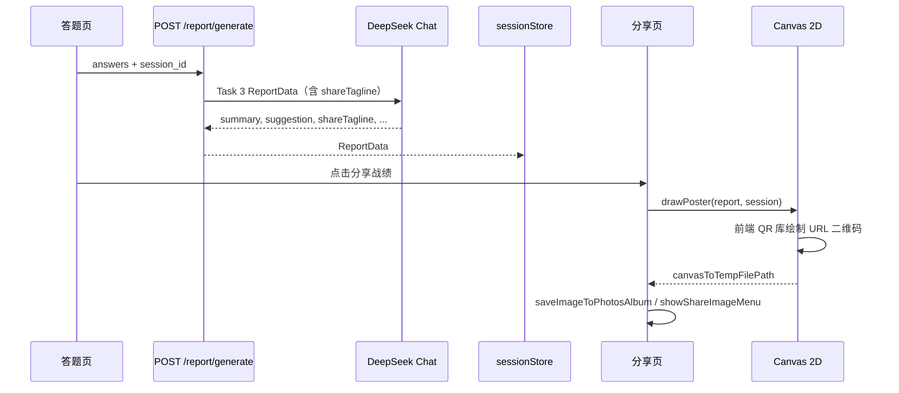

## Context

分享页 `frontend/src/pages/share/index.tsx` 当前为静态 DOM 预览 + 占位 Toast。报告页跳转时已携带 Zustand 中的 `report` / `session`。

**架构调整（相对初版 ai-poster-share）：** 放弃 AI 图像生成 + 服务端 Pillow 合成，改为前端 Canvas + Report 链内 LLM 金句。这与 `AI炼金-方案设计文档.md` Phase 1「canvas 海报」一致，并消除图像 API 成本与 10–30s 等待。

已确认决策：
- LLM 文案 **并入 Report Task 3**（Option A）
- 二维码 **纯前端 QR 库** + URL 落地页

## Goals / Non-Goals

**Goals:**

- 报告生成时同次产出 `shareTagline`，分享页无额外 LLM 等待
- 前端 Canvas 绘制含真实 QR 码的海报，导出本地 PNG
- 保存相册、调起微信 `showShareImageMenu`
- tagline / Canvas 失败有 fallback，不阻断分享链路
- 后端 report 扩展有 TDD 测试

**Non-Goals:**

- AI 图像生成 / 独立图像 API / 服务端海报文件存储
- 微信官方小程序码（`getwxacodeunlimit`）
- 海报历史列表或 DB 存储
- 报告页预渲染 Canvas（分享页按需绘制即可）

## Decisions

### 1. 整体流水线



**理由：** 一次 LLM 调用覆盖报告与分享语；Canvas 本地绘制 <1s，无网络依赖（除 report 已完成）。

### 2. Report 扩展：`shareTagline`

**Schema**（`server/schemas/report.py` + `frontend/src/types/session.ts`）：

```python
share_tagline: str = Field(alias="shareTagline", max_length=24)
```

**Prompt**（`server/prompts/report.txt` 追加）：

```
5. shareTagline：≤20 字，炼金/魔法隐喻风格，可提及 1 个薄弱概念或主题名；
   通关偏庆祝，失败偏鼓励；禁止 emoji 堆叠与敏感内容
```

**Fallback**（服务端 Pydantic 后处理或前端兜底）：

| 条件 | 默认句 |
|------|--------|
| `quiz_status=completed` 且 accuracy≥80 | `{topic} 炼成成功！` |
| `quiz_status=completed` 且 accuracy<80 | `{topic} 初窥门径，继续精炼` |
| `quiz_status=failed` | `灵韵散尽，下次必成` |
| LLM 空/超长 | 同上规则 |

不新增独立 API；report 测试断言 `shareTagline` 存在且长度合规。

### 3. 前端 Canvas 绘制

**文件：** `frontend/src/utils/posterCanvas.ts`

| 层 | 内容 | 参考 |
|----|------|------|
| 背景 | 成功/失败渐变、`comic.scss` 色值 | `--accent-purple`、`--accent-green-light` 等 |
| 装饰 | 虚线圆、旋转「炼！」 | `.share-poster-deco--*` |
| 正文 | 品牌、徽章、正确率%、主题、用时统计 | 现有 share 页 DOM 结构 |
| 标签 | conceptMastery / weakPoints 最多 3 个 | `.share-poster-tags` |
| 金句 | `report.shareTagline` | 新增区域，副标题样式 |
| 底部 | QR +「扫码一起炼金」 | `.share-poster-footer` |

**技术：**

- Taro **Canvas 2D**（`type="2d"`），离屏 canvas，尺寸 **750×1334**（2× 375×667）
- 字体：`PingFang SC` / `sans-serif`（与 `design-tokens.css` 一致，无需加载 webfont）
- 导出：`Taro.canvasToTempFilePath({ canvas, destWidth: 750, destHeight: 1334 })`

**预览：** Canvas 绘制完成后用 `<Image src={tempFilePath} mode="widthFix" />` 展示；可移除占位 DOM 预览。

### 4. 前端 QR 码

**库：** `weapp-qrcode` 或 `uqrcodejs`（微信小程序 Canvas 兼容）

**URL 模板：**

```
{POSTER_SHARE_LANDING_URL}?from=poster&session_id={sessionId}
```

配置位置：`frontend/config/index.ts`（或 env 注入），示例：

```typescript
posterShareLandingUrl: 'https://your-landing.example.com'
```

绘制：QR 库输出到 Canvas 指定矩形（约 120×120px @2x，对应 footer 区域）。

**理由：** 与 Canvas 同层完成，无后端依赖；首版 URL 二维码（非小程序码）。

### 5. 分享操作

**文件：** `frontend/src/utils/posterShare.ts`

| 操作 | API |
|------|-----|
| 相册授权 | `Taro.getSetting` → `Taro.authorize({ scope: 'scope.writePhotosAlbum' })` |
| 保存 | `Taro.saveImageToPhotosAlbum({ filePath: tempFilePath })` |
| 分享 | `wx.showShareImageMenu({ path: tempFilePath })` |

Canvas 导出已是本地路径，**无需** `downloadFile`。

按钮在 `tempFilePath` 就绪前 disabled；Canvas 失败显示重试。

### 6. 分享页状态机

```
进入 → 校验 report/session → drawing → ready | error
         ↓ missing              ↓           ↓
      回首页              重试 draw    启用保存/分享
```

Loading 文案：「正在绘制海报…」（非「AI 生成中」）。

## Risks / Trade-offs

| 风险 | 缓解 |
|------|------|
| Canvas 2D 在 Taro 4 兼容性 | 开发者工具 + 真机验证；参考 Taro 官方 Canvas 2D 示例 |
| 中文绘制/换行 | 手动 measureText 截断；tagline 限制 20 字 |
| QR 库体积 | 选轻量 weapp 专用库 |
| 视觉不如 AI 图多样 | comic 风格统一品牌感；tagline 提供个性化 |
| report Prompt 变更影响现有输出 | 增量字段 + 测试；fallback 保证非空 |

## Migration Plan

1. 后端：扩展 ReportData + prompt + 测试
2. 前端：types/api 映射 `shareTagline`
3. 前端：posterCanvas + QR + share 页改造
4. 配置 `POSTER_SHARE_LANDING_URL`
5. 真机验证保存/分享

回滚：share 页恢复占位；report 新字段可保留（前端忽略即可）。

## Open Questions

| ID | 问题 | 默认 |
|----|------|------|
| OQ-1 | `POSTER_SHARE_LANDING_URL` 具体地址 | 实施前由运营/开发配置体验版链接 |
| OQ-2 | QR 库选型 | 优先 `weapp-qrcode`，不兼容再换 `uqrcodejs` |
